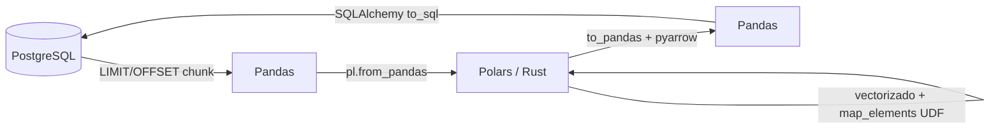

# COLLAPS Docs

Documentación técnica de la suite COLLAPS (GitBook) — **Release Stable**.

## Separation of Concerns

| Capa | Responsabilidad |
|---|---|
| **bttf-engine** (Python) | JOIN paginado → puente **Pandas ↔ Polars** → PostgreSQL → callback n8n |
| **n8n** | Payload camelCase, orquestación, Sync Visores (si `updateSchema`) |
| **PostgreSQL** | Datos + exposición a NocoDB vía `nocodb_light` |
| **NocoDB / Directus** | UI; Meta Sync solo desde n8n |

## Motor híbrido Pandas / Polars



1. Lectura SQL → DataFrame **Pandas** (compatibilidad SQLAlchemy).  
2. `pl.from_pandas` → cómputo en **Polars** (`app/core/polars_transformer.py`).  
3. Métodos nativos vectorizados (math, equals, …) + `map_elements` para UDFs (fuzzy, regex, arrays, …).  
4. `to_pandas()` → persistencia.  
5. Dependencia **`pyarrow`** en `requirements.txt` para el puente eficiente.

## QueryBuilder: alias indexados (anti-colisión)

Si el mismo origen se mapea varias veces, el SQL ya no choca en `col_a`:

```sql
a."cantidad" AS "0_cantidad_a",
a."cantidad" AS "1_cantidad_a"
```

Contrato n8n **sin cambios** (`columnsA` / `columnsB` CSV); el índice es interno al motor.

## Flujo principal

```text
n8n → POST /api/v1/condenser/job
    → AnalysisEngine (LIMIT/OFFSET → Pandas → Polars → Pandas → PG)
    → callback { status, schema, targetTable, updateSchema, filas_insertadas, ... }
        → IF updateSchema: Sync Visores
```

## DevOps Cloud Run (obligatorio)

| Requisito | Valor / flag |
|---|---|
| CPU / RAM | 2 vCPU · 4 GiB |
| Concurrencia / max instances | 2 · 15 |
| **`--no-cpu-throttling`** | **Obligatorio** — sin él GCP corta CPU tras el `202` y asfixia `BackgroundTasks` |
| `DATABASE_URL` | IP correcta (preferible **VPC / privada**) + firewall Cloud SQL |
| Pool / chunk | `DB_POOL_CPU_COUNT=2`, `DB_POOL_DISK_COUNT=1`, `SQL_CHUNK_SIZE=10000` |

```bash
gcloud run deploy bttf-engine \
  --source . \
  --project collaps-prod \
  --region us-central1 \
  --allow-unauthenticated \
  --cpu=2 \
  --memory=4Gi \
  --concurrency=2 \
  --max-instances=15 \
  --no-cpu-throttling
```

## Índice

Ver [`SUMMARY.md`](./SUMMARY.md).

### Arquitectura

- [Visión general](arquitectura/vision-general.md)
- [Componentes y límites](arquitectura/componentes-y-limites.md)
- [Flujo end-to-end](arquitectura/flujo-end-to-end.md)

### Orquestador

- [FastAPI / AnalysisEngine](orquestador/fastapi-analysisengine.md)
- [Payload y contratos](orquestador/payload-y-contratos.md)
- [Integración n8n](orquestador/integracion-n8n.md)
- [WorkTables](orquestador/worktables.md)
- [Sync de visores](orquestador/sync-visores.md)

### Infraestructura · Guías · Despliegue

- [NocoDB](infraestructura/nocodb.md) · [Directus E2E](guias-practicas/directus-end-to-end.md)
- [Variables de entorno](despliegue/variables-entorno.md) · [Cloud Run](despliegue/cloud-run.md) · [Docker / Cloud Build](despliegue/docker-cloud-build.md)
