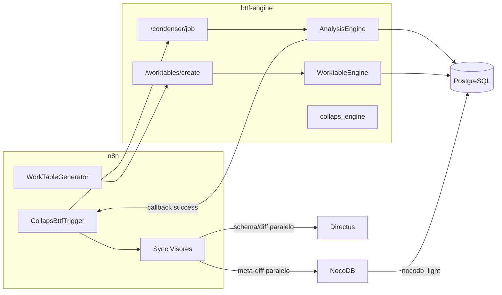

# Componentes y límites

Responsabilidades tras el desacoplamiento CMS ↔ motor (Separation of Concerns).

## Mapa de componentes

---

## 1. Motor Python (`bttf-engine`)

| Hace | No hace |
|---|---|
| Validar payload camelCase | Llamar a Directus / NocoDB |
| JOIN + transformaciones en chunks 50k | Auto-registrar colecciones |
| Inyectar `run_id` incremental y metadatos | Leer `portal_projects` / tokens CMS |
| Persistir en PostgreSQL | Variables `DIRECTUS_*` |
| POST webhook a `callbackUrl` | Orquestar Meta Sync de UIs |

Única comunicación HTTP de salida del job: el **callback** a n8n (`status: success` \| `failed`).

---

## 2. n8n (orquestador)

| Pieza | Rol |
|---|---|
| Nodos Collaps* | Armar payload y disparar motor / worktables |
| Wait + `resumeUrl` | Recibir callback del motor |
| **`sync-visores-nocodb-directus`** | Meta Sync paralelo NocoDB + Directus (timeout 120s, 3 retries) |

Detalle: [Sync de visores](../orquestador/sync-visores.md).

---

## 3. PostgreSQL

Almacén de verdad para orígenes, `c_results_*`, `w_table_*` y control de exposición a NocoDB (`nocodb_light`, `politica_exposicion`).

Ver [NocoDB](../infraestructura/nocodb.md).

---

## 4. Visores (NocoDB / Directus)

| Visor | Cómo se actualiza |
|---|---|
| NocoDB | HTTP `meta-diff` desde n8n; alcance vía rol `nocodb_light` |
| Directus | HTTP `schema/diff` desde n8n |

Ninguno es invocado por el proceso Python.

---

## Matriz de responsabilidades

| Capacidad | Python | n8n | PostgreSQL | Visores |
|---|---|---|---|---|
| Cálculo / chunking | ✅ | ❌ | almacena | ❌ |
| Callback fin de job | ✅ emite | ✅ recibe | — | — |
| Meta Sync UI | ❌ | ✅ | privilegios | reciben |
| Exponer/ocultar tablas BIM | ❌ | ❌ | ✅ `nocodb_light` | ven el resultado |
