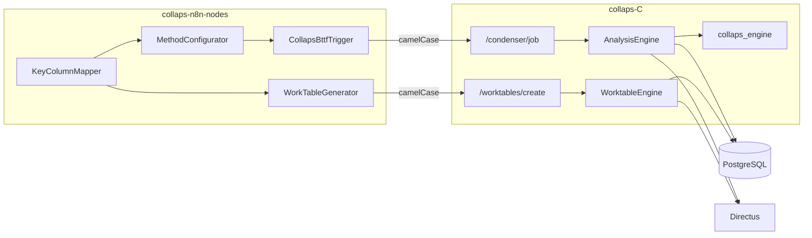

# Componentes y límites

Responsabilidades de cada pieza tras el Refactor Core (contrato camelCase, WorkTables, chunking).

## Mapa de componentes

---

## 1. Motor C (`collaps-C`)

| Pieza | Responsabilidad |
|---|---|
| FastAPI | Routers condenser + worktables |
| `AnalysisPayload` | Contrato camelCase del cruce |
| `WorktableCreatePayload` | Contrato camelCase de tablas de trabajo |
| `AnalysisEngine` | JOIN chunked 50k, `df.apply`, columnas indexadas, `run_id` int |
| `WorktableEngine` | Materialización GROUP BY (esqueleto + persistencia) |
| `collaps_engine` | 21 métodos + aliases legacy |
| `query_builder` | SQL FULL OUTER JOIN |

### Límites del Motor C

**Hace:** validar payload inglés/camelCase; cruzar en chunks; persistir con replace/append; registrar Directus; callback camelCase.

**No hace:** descubrir schemas (n8n); cola durable; `GET /job/{id}`; transportar `options` por método en el payload HTTP actual.

---

## 2. Nodos n8n

| Nodo | Rol |
|---|---|
| Selectores DB/Schema/Table/Column | Descubrimiento |
| KeyColumnMapper / MethodConfigurator | Estructura + métodos |
| **CollapsBttfTrigger** | Frontera camelCase → `/condenser/job`; auto `c_results_*` |
| **CollapsWorkTableGenerator** | Frontera camelCase → `/worktables/create`; auto `w_table_*` |
| DataWatcher | Debug |

### Límites

- El Mapper interno puede seguir en snake_case legacy; el Trigger/WorkTable **traducen** al contrato oficial.  
- `targetTable` del cruce **ya no** lo escribe el usuario: sale del Analysis Name.  
- WorkTable no espera a que termine el Condenser.

---

## 3. PostgreSQL

| Uso | Detalle |
|---|---|
| Origen A/B | Lectura del JOIN / worktable |
| Destino cruce | `c_results_*` — append por `run_id` |
| Destino worktable | `w_table_*` |
| Credenciales Directus | `public.portal_projects` |

**Límite:** unicidad de llaves no garantizada; el engine solo advierte.

---

## 4. Directus

Registro idempotente de colecciones tras persistir. Fallos de Directus no abortan el job de datos.

---

## Matriz de responsabilidades

| Capacidad | n8n | Motor C | PostgreSQL | Directus |
|---|---|---|---|---|
| Descubrir metadatos | ✅ | ❌ | catálogo | ❌ |
| Contrato camelCase | frontera Trigger/WT | valida | — | — |
| JOIN + métodos | elige métodos | ejecuta (chunks) | almacena | — |
| WorkTables | genera payload | materializa | almacena | registra |
| Notificar fin | Wait/resumeUrl | callback | — | — |

## Deuda / límites actuales

1. WorktableEngine: agregaciones avanzadas y callback aún en TODO.  
2. Posible desalineación temporal si un cliente envía arrays donde el API exige CSV strings en WorkTables.  
3. UI estática `/app` puede quedar desfasada del contrato nuevo.
