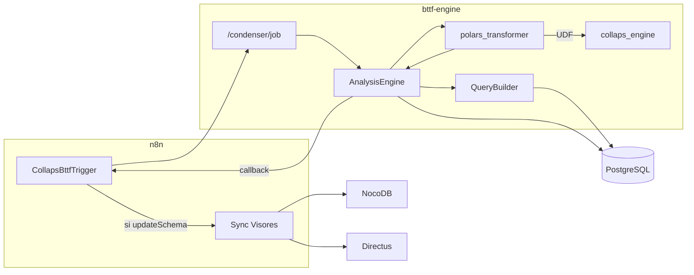

# Componentes y límites

Release Stable: motor híbrido, QueryBuilder indexado, DevOps sin CPU throttling.

## Mapa de componentes

---

## 1. Motor Python

| Hace | No hace |
|---|---|
| JOIN con aliases `{i}_{col}_a` | Llamar a Directus / NocoDB |
| Puente Pandas → Polars → Pandas | Exponer contrato distinto a n8n |
| Vectorizado Polars + UDF `map_elements` | Mantener conexión SQL durante el cómputo |
| Pool fail-fast + paginación | Auto-registrar colecciones |
| Callback `updateSchema` | — |

Módulos clave: `query_builder.py`, `polars_transformer.py`, `analysis_engine.py`, `db.py`.  
Deps: `pandas`, `polars`, **`pyarrow`**, `sqlalchemy`.

---

## 2. QueryBuilder (anti-colisión)

| Antes (roto) | Ahora |
|---|---|
| `a."col" AS "col_a"` (choca si se reusa `col`) | `a."col" AS "0_col_a"`, `a."col" AS "1_col_a"` |

Helper: `sql_source_column_alias(pair_index, col_name, side)`.  
Las columnas **persistidas** siguen el esquema indexado de resultado (`0_colA`, `0_math_sub`, …).

---

## 3. n8n

Sin cambio de contrato HTTP. Los nodos siguen enviando `columnsA` / `columnsB` / `calculationMethods`.  
Reusar la misma columna en varios pares **ahora es seguro** gracias al QueryBuilder.

---

## 4. Cloud Run / red

| Requisito | Por qué |
|---|---|
| `--no-cpu-throttling` | Sin él, tras el `202` GCP baja la CPU y el job en background se ahoga |
| `DATABASE_URL` a IP correcta (VPC/privada preferible) | Evita timeouts / denegaciones de firewall |
| concurrency 2 · max 15 · 2 vCPU · 4 GiB | Escala horizontal + margen de memoria Polars |

---

## Matriz

| Capacidad | Python | n8n | PostgreSQL | Visores |
|---|---|---|---|---|
| Payload camelCase | valida | construye | — | — |
| Alias SQL indexados | ✅ | no ve | ejecuta | — |
| Cómputo Polars | ✅ | ❌ | — | — |
| Meta Sync UI | ❌ | ✅ si `updateSchema` | privilegios | reciben |
