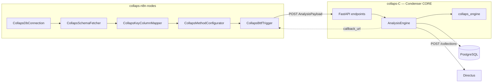

# Componentes y límites

Este documento delimita las responsabilidades de cada pieza de la suite COLLAPS y qué **no** hace cada una. El objetivo es evitar acoplamientos incorrectos al diseñar workflows o evolucionar el código.

## Mapa de componentes



---

## 1. Motor C (`collaps-C`)

Servicio HTTP **Condenser CORE**: orquestador asíncrono + motor matemático empaquetados en el mismo proceso Python.

### Subcomponentes

| Pieza | Ubicación | Responsabilidad |
|---|---|---|
| FastAPI app | `main.py` | Monta router, UI estática en `/app`, redirección `/` → `/app` |
| API condenser | `app/api/endpoints.py` | `POST /job`, `POST /upload` |
| `AnalysisPayload` | `app/models/payload.py` | Validación estricta del contrato JSON |
| `AnalysisEngine` | `app/core/analysis_engine.py` | Ciclo completo del job en background |
| `query_builder` | `app/core/query_builder.py` | Genera el SQL `FULL OUTER JOIN` |
| `db` | `app/core/db.py` | Engine SQLAlchemy cacheado (`DATABASE_URL`) |
| `collaps_engine` | `collaps_engine/` | Transformaciones por par de valores |
| `StorageManager` | `app/core/storage_manager.py` | Upload auxiliar a GCS (endpoint `/upload`) |

### Límites del Motor C

**Hace**

- Validar el payload (identificadores SQL, métodos permitidos, cardinalidad de listas CSV).
- Ejecutar el cruce en PostgreSQL y aplicar métodos del registro de operaciones.
- Persistir resultados en append, migrar columnas nuevas y asegurar PK `id` para Directus.
- Registrar la colección en Directus si hay credenciales en `public.portal_projects`.
- Notificar a `callback_url` con un resumen de éxito/fallo.

**No hace**

- Descubrir esquemas, tablas o columnas (eso es responsabilidad de los nodos n8n).
- Mantener un store de estado de jobs (`GET /job/{id}` no existe).
- Cola distribuida / reintentos / dead-letter: usa `BackgroundTasks` del mismo proceso.
- Aceptar `options` por método desde el payload actual (las transformaciones corren con defaults).
- Sustituir la tabla destino (siempre `if_exists="append"`).

### Ruta legacy (fuera de producción)

`app/core/bttf_engine.py` (`CondenserEngine`) modela un payload modular antiguo y **no está cableado** a ningún router. Además importa `JobPayload`, clase que **no existe** en `app/models/payload.py`. Debe considerarse código huérfano; el camino activo es exclusivamente `AnalysisEngine` + `AnalysisPayload`.

---

## 2. Nodos n8n (`collaps-n8n-nodes`)

Paquete TypeScript que construye el `AnalysisPayload` de forma guiada y lo envía al engine.

### Catálogo de nodos

| Nodo | Rol en el pipeline |
|---|---|
| `CollapsDbConnection` | Valida conexión PostgreSQL y propaga credenciales aguas abajo |
| `CollapsSchemaFetcher` | Lista schemas reales (`pg_namespace`) y fija el seleccionado |
| `CollapsTableSelector` | Lista tablas del schema; emite `{ schema, tableName }` |
| `CollapsColumnSelector` | Multi-selección de columnas; emite `{ schema, tableName, columns[] }` |
| `CollapsKeyColumnMapper` | Fusiona 4 ramas (Key A/B, Columns A/B); construye `bttfPayload` + `column_pairs[]` |
| `CollapsMethodConfigurator` | Asigna `method_id` por par; emite `metodos_calculo` CSV |
| `CollapsBttfTrigger` | Ensambla el payload final y hace `POST` al engine |
| `CollapsDataWatcher` | Debug opcional (`SELECT * LIMIT 10`); no forma parte del contrato |

### Límites de los nodos

**Hacen**

- Descubrir metadatos de PostgreSQL para armar el payload sin hardcodear tablas/columnas.
- Emparejar columnas (manual vía resource mapper, o auto por índice).
- Validar que el número de métodos coincida con el número de pares.
- Disparar el análisis y opcionalmente adjuntar `$execution.resumeUrl` como `callback_url`.

**No hacen**

- Ejecutar el `FULL OUTER JOIN` ni las transformaciones matemáticas.
- Escribir en la tabla destino ni registrar colecciones Directus.
- Gestionar secretos del engine (la URL del BTTF Engine está configurada en el nodo trigger).
- Enviar el formato estructurado `column_comparisons[]` definido en helpers internos: el POST real usa el contrato plano CSV (`columnas_a`, `columnas_b`, `metodos_calculo`).

---

## 3. PostgreSQL

Almacén de verdad para fuentes, resultados y metadatos de proyecto.

### Usos

| Uso | Detalle |
|---|---|
| Tablas origen A/B | Lectura vía SQL generado por `build_analysis_sql` |
| Tabla destino | Append del DataFrame resultante + migración de columnas |
| Credenciales Directus | `public.portal_projects` (`directus_url`, `"Instance_Token"`, `"Schema_Name"`) |
| Metadatos n8n | Los nodos consultan `information_schema` / `pg_catalog` para UI |

### Límites

**Hace / se espera que haga**

- Servir como única fuente de datos del análisis (el path activo no usa CSV de entrada).
- Albergar la tabla destino con PK `id SERIAL` (añadida por el engine si falta).

**No hace (dentro del diseño COLLAPS)**

- Orquestar jobs ni notificar a n8n.
- Validar métodos de cálculo (eso ocurre en Pydantic / `collaps_engine`).
- Garantizar unicidad de las llaves de cruce: si hay duplicados, el `FULL OUTER JOIN` puede producir producto cartesiano; el engine solo emite un *warning* en logs.

### Variable de entorno crítica

| Variable | Rol |
|---|---|
| `DATABASE_URL` | Connection string del engine. Sin ella, la ejecución del análisis falla. Formato `postgresql://...` (`postgres://` se normaliza). |

---

## 4. Directus

Capa de presentación / CMS sobre las tablas de resultado.

### Integración

1. Tras persistir, el engine consulta `public.portal_projects` filtrando por `"Schema_Name" = schema_name`.
2. Si hay `directus_url` + `Instance_Token`, llama:

```http
POST {directus_url}/collections
Authorization: Bearer {Instance_Token}
Content-Type: application/json

{"collection": "<tabla_destino>"}
```

3. Respuestas `400` con colección ya existente (`INVALID_PAYLOAD` / `"already exists"`) se tratan como **idempotentes** (no fallan el job).
4. Antes del registro, se asegura la columna `id SERIAL PRIMARY KEY` en la tabla destino (requisito típico de Directus).

### Límites

**Hace**

- Exponer la tabla destino como colección administrable una vez registrada.

**No hace**

- Participar en el cálculo ni en el JOIN.
- Ser fuente de credenciales vía `.env` del engine: las credenciales se leen de PostgreSQL.
- Bloquear el job si Directus está caído: el fallo se registra como warning y el análisis se considera completado a nivel de persistencia.

---

## Matriz de responsabilidades

| Capacidad | n8n nodes | Motor C | PostgreSQL | Directus |
|---|---|---|---|---|
| Descubrir schema/tablas/columnas | ✅ | ❌ | metadatos | ❌ |
| Validar contrato JSON | parcial | ✅ | ❌ | ❌ |
| FULL OUTER JOIN | ❌ | genera SQL | ejecuta | ❌ |
| Métodos de comparación | elige `method_id` | ejecuta | ❌ | ❌ |
| Persistir resultados | ❌ | orquesta | almacena | ❌ |
| Registrar colección | ❌ | llama API | credenciales | recibe |
| Notificar fin de job | Wait / resumeUrl | POST callback | ❌ | ❌ |

## Deuda técnica relevante (límites actuales)

1. **Sin polling de estado:** solo `callback_url` informa el resultado.
2. **`BackgroundTasks` ≠ cola:** un job largo comparte proceso con el servidor HTTP.
3. **UI estática (`static/index.html`)** alineada al modelo legacy, no a `AnalysisPayload`.
4. **URL del engine hardcodeada** en `CollapsBttfTrigger` (entorno Cloud Run concreto).
5. **Sin `options` por método** en el contrato HTTP actual.
