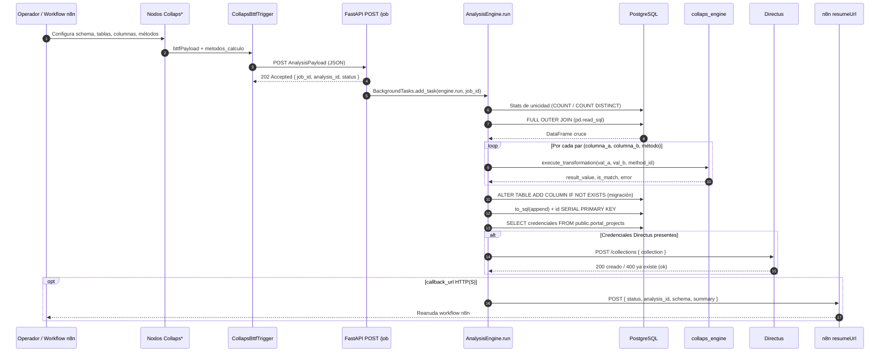

# Flujo end-to-end

Documenta el ciclo de vida completo de un análisis COLLAPS: desde que n8n arma el payload hasta que los resultados viven en PostgreSQL y la colección queda registrada en Directus.

## Diagrama de secuencia



## Fase 1 — Construcción del payload en n8n

Orden recomendado de nodos:

1. **Trigger** (manual, webhook u otro).
2. **`CollapsDbConnection`** — valida PostgreSQL y propaga host/port/database/user.
3. **`CollapsSchemaFetcher`** — selecciona `schema` (p. ej. `s00001_incancer`).
4. **Dos `CollapsTableSelector`** — tabla A y tabla B.
5. **Cuatro `CollapsColumnSelector`** — Key A, Columns A, Key B, Columns B.
6. **`CollapsKeyColumnMapper`** — fusiona las 4 ramas y emite `bttfPayload` + `column_pairs[]`.
7. **`CollapsMethodConfigurator`** — asigna métodos (global o por par) y emite `metodos_calculo`.
8. **`CollapsBttfTrigger`** — añade `nombre_analisis`, `tabla_destino`, `callback_url` opcional y hace el POST.

> Opcional: insertar un nodo **Wait** de n8n antes o en coordinación con el trigger para que `$execution.resumeUrl` exista y el engine pueda reanudar el flujo al terminar.

Detalle de mapeo campo a campo: [Integración n8n](../orquestador/integracion-n8n.md).

## Fase 2 — Aceptación del job (síncrona)

```http
POST /api/v1/condenser/job
Content-Type: application/json
```

1. FastAPI deserializa el body como `AnalysisPayload` (validación Pydantic).
2. Si falla la validación → **`422 Unprocessable Entity`** (el job no se encola).
3. Si es válido:
   - Genera `job_id = uuid4()`.
   - Instancia `AnalysisEngine(payload)`.
   - Encola `engine.run(job_id)` en `BackgroundTasks`.
   - Responde **`202 Accepted`** de inmediato:

```json
{
  "status": "accepted",
  "job_id": "550e8400-e29b-41d4-a716-446655440000",
  "analysis_id": "n8n_1722096123456",
  "message": "Análisis encolado exitosamente"
}
```

En este punto el cliente n8n **ya puede continuar**; el trabajo pesado aún no ha terminado.

## Fase 3 — Ejecución en background (`AnalysisEngine.run`)

### 3.1 Inicialización

- Recibe `job_id` del endpoint.
- Genera un `run_id` nuevo (`uuid4`) por ejecución (permite re-ejecuciones distinguibles).
- Marca `created_at` en UTC.

### 3.2 Generación del SQL de cruce

`build_analysis_sql(payload)` produce un `FULL OUTER JOIN` tipado como texto SQL. Columnas de salida típicas:

| Columna | Significado |
|---|---|
| `llave_cruce` | `COALESCE` de las llaves A/B |
| `<llave>_a` / `<llave>_b` | Llaves originales de cada lado |
| `estado_cruce` | `Match` \| `Only A` \| `Only B` |
| `<col>_a` / `<col>_b` | Pares de columnas de análisis |

Antes del JOIN, el engine consulta estadísticas de unicidad y registra un **warning** si las llaves no son únicas (riesgo de producto cartesiano). **No aborta** el job.

### 3.3 Transformaciones matemáticas

Para cada triple `(columna_a, columna_b, metodo)` y cada fila del DataFrame:

1. Resuelve alias legacy si aplica (`DIFERENCIA` → `math_sub` con operandos invertidos; `IGUALDAD` → `strict_equal`).
2. Llama `collaps_engine.execute_transformation(val_a, val_b, method_id)`.
3. Escribe columnas de resultado:
   - Mismo nombre de columna: `{col}__{method}`
   - Nombres distintos: `{col_a}__vs__{col_b}__{method}`
   - Para métodos no booleanos puros: también `is_match__{result_col}`

### 3.4 Persistencia

1. Sella metadatos: `run_id`, `created_at`, `analysis_id` (si hay), `nombre_analisis` (si hay), `source`.
2. `_auto_migrate_table`: añade columnas nuevas con `ALTER TABLE ... ADD COLUMN IF NOT EXISTS`.
3. `DataFrame.to_sql(..., if_exists="append")` sobre `schema_name.tabla_destino`.
4. Garantiza `id SERIAL PRIMARY KEY` para compatibilidad con Directus.

### 3.5 Registro Directus

Si `public.portal_projects` tiene credenciales para el `schema_name`:

- `POST {directus_url}/collections` con `{"collection": "<tabla_destino>"}`.
- Colección ya existente → se ignora (idempotente).
- Error de red / HTTP inesperado → warning en logs; **no falla** el job de persistencia.

### 3.6 Callback a n8n

Si `callback_url` es HTTP(S), el engine hace `POST` con:

```json
{
  "status": "success",
  "analysis_id": "n8n_1722096123456",
  "schema": "s00001_incancer",
  "summary": {
    "total_rows": 120,
    "matches": 100,
    "only_a": 12,
    "only_b": 8,
    "has_duplicates": false
  }
}
```

En caso de excepción no controlada durante el job, el callback (si existe) se envía con `"status": "failed"`. Un fallo al hacer el callback **no** relanza la excepción del job.

## Fase 4 — Estado final observable

| Artefacto | Dónde queda |
|---|---|
| Filas de resultado | Tabla destino en PostgreSQL (append) |
| Colección UI | Directus (si credenciales disponibles) |
| Señal a n8n | Body del callback a `resumeUrl` |
| Trazas operativas | Logs del proceso Cloud Run / Uvicorn |

No hay endpoint de consulta por `job_id`. Si no se configuró `callback_url`, el único rastro post-`202` son los logs y la tabla destino.

## Casos de borde importantes

| Situación | Comportamiento |
|---|---|
| Payload inválido | `422` síncrono; no hay background task |
| Llaves no únicas | Warning + posible multiplicación de filas |
| Tabla destino sin columnas nuevas | Append directo; migración no-op |
| Directus sin fila en `portal_projects` | Se omite el registro; job sigue |
| Engine reiniciado a mitad del job | Job perdido (sin cola durable) |
| `callback_url` vacío o no HTTP | No se notifica a n8n |

## Referencias

- Endpoint y asincronía: [FastAPI / AnalysisEngine](../orquestador/fastapi-analysisengine.md)
- Contrato JSON: [Payload y contratos](../orquestador/payload-y-contratos.md)
- Ensamblado desde nodos: [Integración n8n](../orquestador/integracion-n8n.md)
