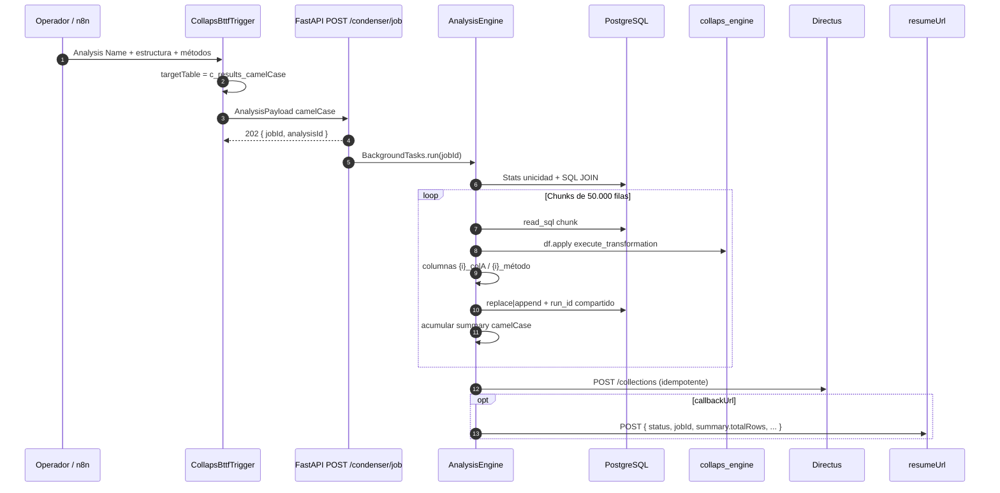

# Flujo end-to-end

Ciclo de vida de un análisis COLLAPS tras el Refactor Core: contrato camelCase, chunks anti-OOM, columnas indexadas y `run_id` incremental.

## Diagrama de secuencia (Condenser)



## Fase 1 — Construcción en n8n

1. DbConnection → Schema → Tables → Columns (× lados A/B).  
2. KeyColumnMapper → MethodConfigurator.  
3. **CollapsBttfTrigger**: solo pide *Analysis Name*; genera `targetTable` y `callbackUrl`.  
4. Opcional en paralelo: **CollapsWorkTableGenerator** → `/worktables/create`.

Detalle: [Integración n8n](../orquestador/integracion-n8n.md).

## Fase 2 — Aceptación (`202`)

```http
POST /api/v1/condenser/job
Content-Type: application/json
```

```json
{
  "status": "accepted",
  "jobId": "550e8400-e29b-41d4-a716-446655440000",
  "analysisId": "n8n_1722096123456",
  "message": "Analysis job queued successfully"
}
```

Payload inválido → `422` (no se encola).

## Fase 3 — Ejecución chunked

| Aspecto | Comportamiento |
|---|---|
| Lectura | `chunksize=50000` |
| Transform | `df.apply(axis=1)` por par de columnas |
| Columnas resultado | Bloques indexados `0_*`, `1_*`, … |
| Metadatos | Al final: `run_id`, `created_at`, `timestamp`, `job_id`, `estado_cruce`, … |
| `run_id` | Entero `MAX+1`, **una vez por job**, mismo valor en todos los chunks |
| Persistencia | `replace` solo primer chunk si la tabla es nueva; luego `append` |
| Summary | Acumulado dinámico para el webhook |

## Fase 4 — Observabilidad

| Artefacto | Dónde |
|---|---|
| Filas | `schema.targetTable` (p. ej. `c_results_precioFrutas`) |
| Colección UI | Directus (si hay credenciales en `portal_projects`) |
| Señal n8n | Callback camelCase a `callbackUrl` |
| Logs | Cloud Run / Uvicorn |

## WorkTables (flujo hermano)

```text
CollapsWorkTableGenerator
  → POST /api/v1/worktables/create
    → 202 { jobId, targetTable }
      → WorktableEngine (GROUP BY / ORDER BY → w_table_*)
```

Ver [WorkTables](../orquestador/worktables.md).

## Casos de borde

| Situación | Comportamiento |
|---|---|
| Payload con campos españoles antiguos | No es el contrato oficial; el Trigger n8n ya traduce |
| Llaves no únicas | Warning + posible multiplicación de filas |
| Engine reiniciado mid-job | Chunks en curso se pierden (sin cola durable) |
| Sin `callbackUrl` | Solo logs + tabla destino |

## Referencias

- [Payload y contratos](../orquestador/payload-y-contratos.md)
- [FastAPI / AnalysisEngine](../orquestador/fastapi-analysisengine.md)
