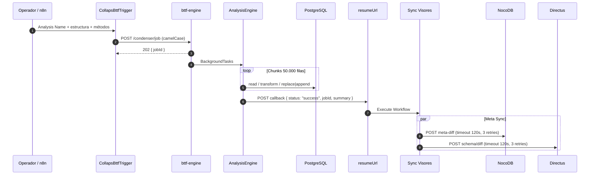

# Flujo end-to-end

Ciclo de vida completo: motor desacoplado de CMS + sync de visores en n8n.

## Diagrama de secuencia

## Fase 1 — n8n arma y dispara

Mapper → Methods → **CollapsBttfTrigger** (auto `c_results_*` + `callbackUrl`).  
Opcional: **WorkTableGenerator** → `/worktables/create`.

## Fase 2 — Motor (solo datos)

1. `202 Accepted` inmediato.  
2. Chunks de 50k, `run_id` entero, columnas indexadas.  
3. Persistencia PostgreSQL.  
4. **No** hay llamadas a Directus/NocoDB.  
5. Callback HTTP a n8n.

## Fase 3 — Sync de visores (n8n)

Tras el webhook de éxito, el flujo principal invoca `sync-visores-nocodb-directus.json`:

- NocoDB y Directus en **paralelo**  
- Timeout **120.000 ms**  
- Retry On Fail: **3 intentos**  

Ver [Sync de visores](../orquestador/sync-visores.md) y [NocoDB](../infraestructura/nocodb.md).

## Observabilidad

| Artefacto | Dónde |
|---|---|
| Filas de resultado | PostgreSQL (`c_results_*` / `w_table_*`) |
| Señal de fin | Callback camelCase a n8n |
| Catálogo UI | NocoDB / Directus **después** del Meta Sync |

## Referencias

- [FastAPI / AnalysisEngine](../orquestador/fastapi-analysisengine.md)  
- [Payload y contratos](../orquestador/payload-y-contratos.md)  
- [Integración n8n](../orquestador/integracion-n8n.md)
