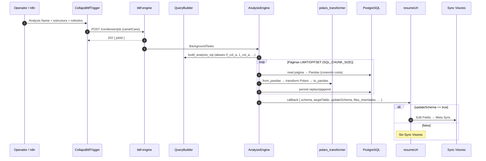
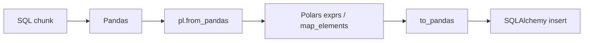

# Flujo end-to-end

Ciclo de vida Release Stable: motor híbrido Pandas/Polars, alias SQL indexados, guardia `updateSchema`.

## Diagrama de secuencia

## Fase 1 — n8n arma y dispara

Mapper → Methods → **CollapsBttfTrigger** (`c_results_*` + `callbackUrl`).  
El contrato JSON **no cambia** con Polars ni con los alias indexados.

## Fase 2 — Motor (datos)

1. `202 Accepted` inmediato (**requiere** `--no-cpu-throttling` en Cloud Run para no asfixiar el background).  
2. SQL con aliases `{pairIndex}_{col}_a` / `{pairIndex}_{col}_b` (anti-colisión).  
3. Por página: leer Pandas → Polars → transformar → Pandas → escribir.  
4. Pool fail-fast; sin llamadas a CMS.  
5. Callback con `updateSchema` / `filas_insertadas`.

## Fase 3 — Guardia de tráfico + Sync Visores

| `updateSchema` | Acción |
|---|---|
| `true` | Edit Fields (`schema`) → Sync Visores |
| `false` | Omitir Meta Sync |

## Puente de datos Pandas ↔ Polars

`pyarrow` acelera el round-trip. Ver [FastAPI / AnalysisEngine](../orquestador/fastapi-analysisengine.md).

## Referencias

- [Payload y contratos](../orquestador/payload-y-contratos.md)  
- [Integración n8n](../orquestador/integracion-n8n.md)  
- [Cloud Run](../despliegue/cloud-run.md)
