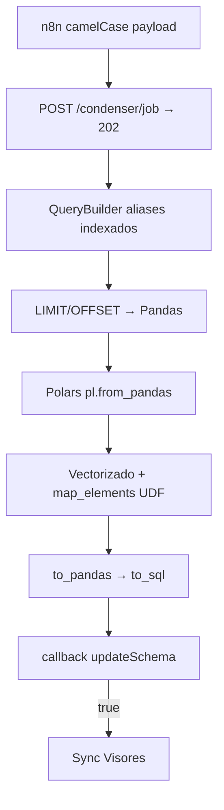

# Visión general

## Qué es COLLAPS

**COLLAPS** (suite *Collaps BIM-OS*) cruza dos tablas PostgreSQL, aplica un catálogo de métodos matemáticos/lógicos (motor híbrido **Pandas ↔ Polars**) y materializa resultados en Postgres. Los **visores** (NocoDB / Directus) se actualizan por separado desde n8n.

El backend **Condenser CORE** (`bttf-engine` / `collaps-C`) se dedica al cómputo y la persistencia. n8n orquesta el payload, recibe el callback y sincroniza las UIs.

## Separation of Concerns

| Responsabilidad | Quién |
|---|---|
| JOIN paginado, puente Pandas/Polars, `run_id`, escribir PG | Motor Python |
| Webhook `status` + `updateSchema` | Motor → n8n |
| Meta Sync de visores | n8n (`sync-visores-nocodb-directus`) |
| Exponer subconjunto de tablas al UI | PostgreSQL (`nocodb_light`) |

El motor **no** habla con Directus ni NocoDB.

## Propósito

| Objetivo | Cómo lo resuelve |
|---|---|
| Cruzar dos fuentes | `FULL OUTER JOIN` por `joinKeyA` / `joinKeyB` |
| Comparar columnas | Polars nativo + UDFs `collaps_engine` vía `map_elements` |
| Evitar colisión SQL al reusar columnas | Alias indexados `{i}_{col}_a` / `{i}_{col}_b` |
| No bloquear n8n | `202` + `BackgroundTasks` + `callbackUrl` |
| Estabilidad CPU en background | Cloud Run **`--no-cpu-throttling`** |
| Evitar OOM / pool exhaustion | `SQL_CHUNK_SIZE` + pool fail-fast + concurrency 2 |
| Refrescar UIs | Sync Visores solo si `updateSchema` |

## Flujo conceptual (datos)

## Lectura recomendada

| Documento | Contenido |
|---|---|
| [Componentes y límites](componentes-y-limites.md) | Quién hace qué |
| [Flujo end-to-end](flujo-end-to-end.md) | Ciclo de vida |
| [FastAPI / AnalysisEngine](../orquestador/fastapi-analysisengine.md) | Motor híbrido y pool |
| [Cloud Run](../despliegue/cloud-run.md) | `--no-cpu-throttling` y red |
