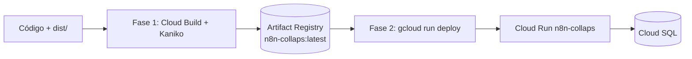

# Docker / Cloud Build — Nodos n8n (`n8n-collaps`)

Pipeline de **2 fases** para construir y publicar el runtime n8n con los nodos custom COLLAPS (`collaps-n8n-nodes`).



---

## Prerrequisitos

1. Compilar TypeScript localmente (`npm run build` / equivalente) para generar `dist/`.
2. El `Dockerfile` copia solo `package.json` + `dist/` e instala deps de producción dentro de la imagen.
3. Proyecto GCP: `collaps-prod`.
4. Artifact Registry: `us-central1-docker.pkg.dev/collaps-prod/n8n-repo/n8n-collaps`.

### Imagen base (Dockerfile)

```dockerfile
FROM n8nio/n8n:2.31.4
# ...
WORKDIR /home/node/.n8n/custom/node_modules/n8n-nodes-collaps
COPY package.json ./
COPY dist ./dist
RUN npm install --omit=dev --no-audit --no-fund
```

Los nodos quedan montados como paquete custom dentro de la imagen oficial de n8n.

---

## Fase 1 — Build con Kaniko (Cloud Build)

Archivo de referencia en el repo: `cloudbuild.yaml`.

```yaml
steps:
  - name: 'gcr.io/kaniko-project/executor:latest'
    args:
      - '--destination=us-central1-docker.pkg.dev/collaps-prod/n8n-repo/n8n-collaps:latest'
      - '--cache=true'
      - '--cache-ttl=168h'
```

| Arg Kaniko | Efecto |
|---|---|
| `--destination=.../n8n-collaps:latest` | Push a Artifact Registry |
| `--cache=true` | Reutiliza capas cacheadas |
| `--cache-ttl=168h` | TTL de caché = 7 días |

### Disparo desde PowerShell (Here-String)

Patrón operativo: enviar el YAML inline a `gcloud builds submit` sin depender de un archivo local modificado:

```powershell
$cloudbuild = @"
steps:
  - name: 'gcr.io/kaniko-project/executor:latest'
    args:
      - '--destination=us-central1-docker.pkg.dev/collaps-prod/n8n-repo/n8n-collaps:latest'
      - '--cache=true'
      - '--cache-ttl=168h'
"@

$cloudbuild | Out-File -Encoding utf8 cloudbuild.yaml

gcloud builds submit `
  --project collaps-prod `
  --config cloudbuild.yaml `
  .
```

Alternativa: mantener `cloudbuild.yaml` en el repo y ejecutar solo:

```powershell
gcloud builds submit --project collaps-prod --config cloudbuild.yaml .
```

**Resultado esperado:** imagen `us-central1-docker.pkg.dev/collaps-prod/n8n-repo/n8n-collaps:latest` disponible en Artifact Registry.

---

## Fase 2 — Deploy en Cloud Run + Cloud SQL

Tras el build exitoso, despliega el servicio `n8n-collaps` apuntando a la imagen publicada e inyectando Cloud SQL y variables de entorno.

```powershell
gcloud run deploy n8n-collaps `
  --project collaps-prod `
  --region us-central1 `
  --image us-central1-docker.pkg.dev/collaps-prod/n8n-repo/n8n-collaps:latest `
  --allow-unauthenticated `
  --add-cloudsql-instances PROJECT:REGION:INSTANCE `
  --set-env-vars "WEBHOOK_URL=https://YOUR_N8N_HOST/,N8N_HOST=YOUR_N8N_HOST,N8N_PROTOCOL=https,N8N_PORT=443"
```

### Flags críticos

| Flag | Rol |
|---|---|
| `--image .../n8n-collaps:latest` | Usa la imagen de la Fase 1 |
| `--add-cloudsql-instances` | Monta el conector Cloud SQL (socket `/cloudsql/...`) para la DB de n8n |
| `--set-env-vars` | Inyecta `WEBHOOK_URL` y resto de config n8n |
| `--allow-unauthenticated` | Acceso HTTP al editor/webhooks (valorar restricción IAM en prod endurecida) |

### Variables de entorno recomendadas

| Variable | Propósito |
|---|---|
| `WEBHOOK_URL` | Base pública para webhooks y `$execution.resumeUrl` (callback del motor) |
| `N8N_HOST` | Hostname público del servicio |
| `N8N_PROTOCOL` | Típicamente `https` detrás de Cloud Run |
| `N8N_PORT` | Típicamente `443` en exposición HTTPS |
| Vars de DB n8n | Connection string / host Cloud SQL según la imagen oficial |

> Sustituye `PROJECT:REGION:INSTANCE` y los hosts por los valores reales del entorno. **No documentes contraseñas.**

Detalle relacionado: [Variables de entorno](variables-entorno.md).

---

## Orden operativo completo

| Paso | Acción | Criterio de éxito |
|---|---|---|
| 0 | `npm run build` (generar `dist/`) | Existe `dist/nodes/...` |
| 1 | `gcloud builds submit` + Kaniko | Imagen `:latest` en Artifact Registry |
| 2 | `gcloud run deploy n8n-collaps` | Revisión Healthy en Cloud Run |
| 3 | Verificar nodos Collaps* en el editor n8n | Aparecen en la paleta |
| 4 | Smoke: workflow → `CollapsBttfTrigger` → `bttf-engine` | HTTP 202 del motor |

---

## Separación de responsabilidades de deploy

| Artefacto | Cómo se despliega |
|---|---|
| Motor Python `bttf-engine` | `gcloud run deploy --source .` → ver [Cloud Run](cloud-run.md) |
| Runtime n8n + nodos `n8n-collaps` | Kaniko (Fase 1) + `gcloud run deploy --image` (Fase 2) |

No mezclar: el motor **no** usa este `cloudbuild.yaml` de Kaniko; n8n **no** se despliega con `--source .` del repo Python.

## Notas

1. La caché Kaniko (`168h`) acelera rebuilds cuando `package.json` / capas base no cambian.
2. Si cambias solo TypeScript, asegúrate de regenerar `dist/` **antes** del `gcloud builds submit`.
3. `WEBHOOK_URL` incorrecta rompe el patrón Wait/resume hacia el motor (`callbackUrl`).
