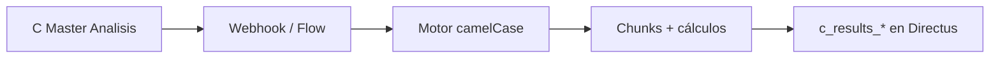

# Guía práctica: análisis end-to-end desde Directus

Manual para configurar un cruce COLLAPS desde la colección **C Master Analisis** (o el Flow que la dispare), **sin programar**.

> Tras el Refactor Core, el **contrato HTTP** hacia el motor usa inglés y **camelCase** (`tableA`, `calculationMethods`, `targetTable`, …). En Directus puedes seguir viendo etiquetas en español: lo importante es que el Flow/webhook envíe los nombres nuevos al API.

---

## ¿Qué vas a lograr?

1. Definir un análisis (dos tablas, llaves, columnas y métodos).  
2. Disparar el job al motor (`POST /api/v1/condenser/job`).  
3. Revisar la tabla de resultados `c_results_*` (columnas indexadas + metadatos a la derecha).



---

## Idea general (ETL)

| Capa | Pregunta | Concepto |
|---|---|---|
| Origen | ¿De dónde salen los datos? | Tabla A / Tabla B → API: `tableA`, `tableB` |
| Cruce | ¿Cómo emparejo filas? | Llaves → `joinKeyA`, `joinKeyB` |
| Transformación | ¿Qué comparo y cómo? | Columnas + métodos → `columnsA`, `columnsB`, `calculationMethods` |
| Destino | ¿Dónde guardo? | Preferible `c_results_<nombreAmigable>` → `targetTable` |

---

## Etiquetas clave → contrato API

| Etiqueta en Directus (humana) | Campo JSON al motor | Cómo llenarla |
|---|---|---|
| Tabla A | `tableA` | Nombre de tabla origen A (`modelo`) |
| Tabla B | `tableB` | Nombre de tabla origen B (`contrato`) |
| Llave Cruce A | `joinKeyA` | ID de join en A (`codigo`) |
| Llave Cruce B | `joinKeyB` | ID de join en B |
| Columnas A | `columnsA` | CSV de campos a calcular |
| Columnas B | `columnsB` | CSV alineado 1:1 con A |
| Metodos Calculo | `calculationMethods` | CSV de `method_id` exactos |
| Nombre Analisis | `analysisName` | Texto legible |
| Tabla Destino | `targetTable` | Ej. `c_results_precioFrutas` |
| Schema | `schemaName` | Schema del proyecto |
| Analysis ID | `analysisId` | Opcional |

### Metodos Calculo

Escribe exactamente el `method_id` (o alias legacy):

- `math_sub`, `math_tolerance`, `strict_equal`, `normalized_equal`  
- `fuzzy_levenshtein`, `date_equal`, …  
- Legacy: `DIFERENCIA`, `IGUALDAD`  

**Misma cantidad** de ítems en Columnas A, Columnas B y Métodos.

Ejemplo:

```text
columnsA:             cantidad,descripcion
columnsB:             cantidad,descripcion
calculationMethods:   math_sub,normalized_equal
```

---

## Ejemplo completo

| Campo UI | Valor | JSON |
|---|---|---|
| Tabla A | `modelo` | `"tableA": "modelo"` |
| Tabla B | `contrato` | `"tableB": "contrato"` |
| Llave A/B | `codigo` | `"joinKeyA"/"joinKeyB"` |
| Columnas | `cantidad,descripcion` | `columnsA` / `columnsB` |
| Métodos | `math_sub,normalized_equal` | `calculationMethods` |
| Nombre | `Precio Frutas` | `analysisName` |
| Destino | `c_results_precioFrutas` | `targetTable` |

Payload resultante (simplificado):

```json
{
  "source": "directus",
  "analysisName": "Precio Frutas",
  "tableA": "modelo",
  "tableB": "contrato",
  "joinKeyA": "codigo",
  "joinKeyB": "codigo",
  "columnsA": "cantidad,descripcion",
  "columnsB": "cantidad,descripcion",
  "calculationMethods": "math_sub,normalized_equal",
  "targetTable": "c_results_precioFrutas"
}
```

---

## Qué pasa al disparar

1. El motor responde `202` con `jobId` (no esperes el resultado en esa respuesta).  
2. Procesa el cruce en **bloques de 50.000 filas** (no carga toda la tabla en RAM).  
3. Asigna un `run_id` **entero** (1, 2, 3…) a toda la corrida.  
4. Añade filas a `targetTable` y, si puede, registra la colección en Directus.

---

## Cómo leer la tabla de resultados

### Bloques por par (izquierda)

Para el primer par (índice `0`), el segundo (`1`), etc.:

| Columna | Ejemplo | Significado |
|---|---|---|
| `{i}_{campo}A` | `0_cantidadA` | Valor lado A |
| `{i}_{campo}B` | `0_cantidadB` | Valor lado B |
| `{i}_metodo_aplicado` | `0_metodo_aplicado` | Método pedido |
| `{i}_{metodo}` | `0_math_sub` | Resultado |
| `{i}_is_match` | `0_is_match` | ¿Match? (si aplica) |

Así todos los cálculos del mismo par quedan **agrupados** visualmente.

### Metadatos (extrema derecha)

Siempre al final:

`run_id` · `created_at` · `timestamp` · `job_id` · `estado_cruce` · `analysis_id` · `analysis_name` · `source`

| Campo | Uso práctico |
|---|---|
| `run_id` | Filtra “solo la última corrida” (número entero) |
| `estado_cruce` | `Match` / `Only A` / `Only B` |
| `job_id` | Traza técnica del encolado HTTP |
| `analysis_name` | El nombre que pusiste en Directus |

### Cómo filtrar

1. Filtra por el `run_id` más alto.  
2. Revisa `Only A` / `Only B` para faltantes.  
3. En `0_math_sub` (u otro), busca diferencias ≠ 0.  
4. En iguales/fuzzy, busca `false` o `0_is_match = false`.

---

## Errores frecuentes

| Problema | Qué revisar |
|---|---|
| `422` del API | Campos camelCase, métodos válidos, CSVs alineados |
| Signo “al revés” | `DIFERENCIA` (B−A) vs `math_sub` (A−B) |
| Muchas filas | Llave de cruce no única |
| No veo colección | Primera vez / credenciales Directus; la tabla puede existir igual en PG |

## Checklist

- [ ] `tableA` / `tableB` / llaves correctas  
- [ ] Misma cantidad en columnsA, columnsB, calculationMethods  
- [ ] `method_id` exactos  
- [ ] `targetTable` con prefijo `c_results_` recomendado  
- [ ] Nombre de análisis claro para filtrar por `analysis_name` / `run_id`

## Siguiente lectura

- [Payload y contratos](../orquestador/payload-y-contratos.md)  
- [Motor matemático](../motor-matematico/conceptos-base.md)  
- [WorkTables](../orquestador/worktables.md) (tablas `w_table_*`)
