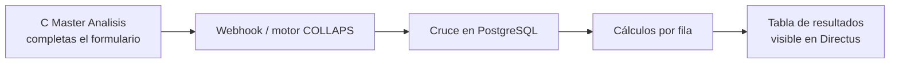

# Guía práctica: análisis end-to-end desde Directus

Manual para configurar un cruce COLLAPS desde la colección **C Master Analisis** en Directus, **sin necesidad de programar**.

Si sabes pensar en “tengo dos tablas, las uno por un ID y comparo unas columnas”, ya tienes el 90% del concepto.

---

## ¿Qué vas a lograr?

1. Llenar un registro en **C Master Analisis** describiendo el cruce.  
2. Disparar el análisis (webhook / flujo conectado a Directus).  
3. Revisar la **tabla de resultados** que genera el sistema (y que Directus puede mostrar como colección).



---

## Idea general (esquema ETL clásico)

Piensa el análisis como una receta de cocina con tres capas:

| Capa | Pregunta | Campos en Directus |
|---|---|---|
| **Origen** | ¿De dónde salen los datos? | Tabla A, Tabla B |
| **Cruce** | ¿Cómo emparejo las filas? | Llave Cruce A, Llave Cruce B |
| **Transformación** | ¿Qué comparo y cómo? | Columnas A, Columnas B, Metodos Calculo |

Luego defines **dónde guardar** el resultado (tabla destino) y un nombre legible para el análisis.

---

## Paso a paso en Directus

### 1. Abre la colección **C Master Analisis**

Crea un ítem nuevo (o edita uno existente). Cada ítem = **una configuración de análisis**.

### 2. Completa las etiquetas clave

Los nombres en pantalla pueden variar ligeramente (mayúsculas, espacios), pero el significado es este:

#### Tabla A / Tabla B

| Campo | Significado | Cómo llenarlo |
|---|---|---|
| **Tabla A** | Primera fuente de datos (origen “lado A”) | Nombre de la tabla en la base, ej. `modelo`, `bim_cantidades` |
| **Tabla B** | Segunda fuente (origen “lado B”) | Ej. `contrato`, `presupuesto` |

**Consejo:** A suele ser el modelo / lo medido; B suele ser el contrato / la referencia. Lo importante es ser consistente con las columnas y el método (sobre todo con restas).

No hace falta escribir el schema delante (`s00001_incancer.modelo`); el sistema ya trabaja con el schema del proyecto. Si lo escribes calificado, el motor se queda solo con el nombre de tabla.

#### Llave Cruce A / Llave Cruce B

| Campo | Significado | Cómo llenarlo |
|---|---|---|
| **Llave Cruce A** | Campo de la Tabla A que identifica la fila | Ej. `codigo`, `id_partida`, `guid` |
| **Llave Cruce B** | Campo equivalente en la Tabla B | Puede llamarse igual o distinto (`codigo_contrato`) |

Es el criterio del **JOIN**: “une la fila de A con la de B cuando estas llaves coinciden”.

**Ejemplo:**  
- Tabla A `modelo`, llave `codigo_item`  
- Tabla B `contrato`, llave `codigo_item`  
→ Cada código se empareja; si solo existe en un lado, igual aparece en el resultado marcado como *Only A* o *Only B*.

#### Columnas A / Columnas B

| Campo | Significado | Cómo llenarlo |
|---|---|---|
| **Columnas A** | Campos de A que se van a calcular | Uno o varios separados por coma |
| **Columnas B** | Campos de B que se comparan **en el mismo orden** | Misma cantidad de nombres |

Aquí no pones la llave de cruce (salvo que también quieras calcular sobre ella). Pones lo que vas a **medir o comparar**: cantidades, precios, fechas, textos…

**Ejemplo**

```text
Columnas A: cantidad,precio
Columnas B: cantidad,precio
```

Eso significa dos pares:

1. `cantidad` (A) contra `cantidad` (B)  
2. `precio` (A) contra `precio` (B)

#### Metodos Calculo

| Campo | Significado | Cómo llenarlo |
|---|---|---|
| **Metodos Calculo** | Qué operación aplica a **cada** par de columnas | Lista de `method_id` separados por coma, **en el mismo orden** |

Debes escribir exactamente el identificador del método, por ejemplo:

- `math_sub` — resta A − B  
- `math_diff_abs` — diferencia absoluta  
- `strict_equal` — igualdad exacta  
- `normalized_equal` — igualdad ignorando acentos/mayúsculas  
- `fuzzy_levenshtein` — similitud de texto (typos)  
- `date_equal` — mismo día  
- `DIFERENCIA` / `IGUALDAD` — alias antiguos (ver [Legacy](../motor-matematico/legacy.md))

**Ejemplo alineado con las columnas de arriba**

```text
Columnas A:       cantidad,precio
Columnas B:       cantidad,precio
Metodos Calculo:  math_sub,strict_equal
```

Lectura humana:

1. Compara cantidades con resta (`math_sub`).  
2. Compara precios con igualdad estricta (`strict_equal`).

> La cantidad de métodos **debe coincidir** con la cantidad de columnas A y B.  
> Tres columnas A → tres columnas B → tres métodos.

Catálogo completo: [Conceptos base](../motor-matematico/conceptos-base.md) y páginas del motor matemático.

#### Otros campos útiles

| Campo típico | Para qué sirve |
|---|---|
| **Nombre Analisis** / `nombre_analisis` | Etiqueta legible (“Cruce modelo vs contrato — torre A”). Se guarda en las filas de resultado. |
| **Tabla Destino** / `tabla_destino` | Nombre de la tabla donde se **añaden** (append) los resultados. Ej. `c_resultado_cruce`. |
| **Schema** / `schema_name` | Schema del proyecto (a menudo ya viene por defecto del entorno). |
| **Analysis ID** | Identificador del análisis (si el flujo lo genera o lo pegas a mano). |

---

## Ejemplo completo de configuración

Escenario: comparar cantidades y descripción entre modelo y contrato.

| Etiqueta | Valor de ejemplo |
|---|---|
| Tabla A | `modelo` |
| Tabla B | `contrato` |
| Llave Cruce A | `codigo` |
| Llave Cruce B | `codigo` |
| Columnas A | `cantidad,descripcion` |
| Columnas B | `cantidad,descripcion` |
| Metodos Calculo | `math_sub,normalized_equal` |
| Tabla Destino | `c_resultado_modelo_contrato` |
| Nombre Analisis | `Cruce cantidades y descripción — Jul 2026` |

Interpretación:

- Une por `codigo`.  
- Resta cantidades (A − B).  
- Compara descripciones tolerando mayúsculas/acentos (`Café` ≈ `cafe`).  
- Guarda (acumula) filas en `c_resultado_modelo_contrato`.

---

## Qué pasa al disparar el análisis

1. Directus (o el flujo asociado) envía la configuración al motor COLLAPS.  
2. El motor responde rápido “aceptado” y trabaja en segundo plano.  
3. Cruza las tablas, aplica los métodos fila a fila y **añade** filas a la tabla destino.  
4. Si el proyecto tiene Directus configurado, intenta **registrar** esa tabla como colección para que la veas en el panel.

No necesitas borrar la tabla destino cada vez: el sistema **agrega** corridas (cada una con su `run_id` y fecha).

---

## Cómo leer la tabla de resultados

Cuando abras la colección / tabla de resultados, verás algo así (nombres aproximados):

### Columnas del cruce

| Columna | Significado |
|---|---|
| `llave_cruce` | ID con el que se unieron las filas |
| `estado_cruce` | `Match` = estaba en A y B; `Only A` / `Only B` = solo en un lado |
| `..._a` / `..._b` | Valores originales de cada lado (llaves y columnas analizadas) |

### Columnas del cálculo

Según el método, aparecen columnas con nombres del estilo:

| Patrón | Ejemplo | Significado |
|---|---|---|
| `{col}__{metodo}` | `cantidad__math_sub` | Resultado del cálculo cuando A y B usan el mismo nombre de columna |
| `{colA}__vs__{colB}__{metodo}` | `precio__vs__costo__math_sub` | Resultado cuando los nombres difieren |
| `is_match__...` | `is_match__descripcion__fuzzy_levenshtein` | ¿El motor considera que hubo coincidencia? (cuando aplica) |

Para métodos de sí/no (`strict_equal`, `normalized_equal`, etc.), el propio valor de la columna de resultado ya es `true`/`false`.

### Metadatos de la corrida

| Columna | Para qué sirve |
|---|---|
| `run_id` | Identifica esa ejecución (puedes filtrar “solo esta corrida”) |
| `created_at` | Cuándo se generó |
| `nombre_analisis` | El nombre que pusiste en Directus |
| `analysis_id` | ID del análisis, si venía en el payload |
| `source` | Origen del disparo (`directus` o `n8n`) |
| `id` | Clave interna de Directus / Postgres |

### Cómo filtrar en la práctica

1. Ordena o filtra por `created_at` / `run_id` para ver la última corrida.  
2. Mira `estado_cruce = Only A` o `Only B` para códigos que no cruzaron.  
3. En columnas numéricas (`...__math_sub`), busca diferencias distintas de cero.  
4. En columnas de igualdad/similitud, filtra `false` o `is_match = false` para excepciones.

---

## Errores frecuentes (y cómo evitarlos)

| Problema | Causa típica | Qué hacer |
|---|---|---|
| El análisis no arranca | Falta un campo obligatorio o un método mal escrito | Revisa que Tabla A/B, llaves, columnas, métodos y destino estén llenos; el `method_id` debe existir |
| “No coinciden las listas” | 3 columnas A pero 2 métodos | Misma cantidad en Columnas A, Columnas B y Metodos Calculo |
| Resultados con signo “al revés” | Usaste `DIFERENCIA` vs `math_sub` | Lee [Legacy](../motor-matematico/legacy.md): `DIFERENCIA` calcula B − A |
| Muchas filas duplicadas | La llave de cruce no es única | Elige un ID único por fila en ambas tablas |
| No veo la colección nueva | Primera vez o sin credenciales Directus en el portal | Pide a TI que revise `portal_projects` / registro de colección; la tabla puede existir igual en la base |

---

## Checklist rápido antes de disparar

- [ ] Tablas A y B existen y tienen datos  
- [ ] Llaves de cruce identifican bien cada fila  
- [ ] Columnas A/B/métodos tienen **la misma cantidad** de ítems  
- [ ] Cada método está escrito exactamente (`math_sub`, no “resta”)  
- [ ] Tabla destino definida (y sabes que se hará *append*)  
- [ ] Nombre de análisis claro para filtrar después  

---

## Siguiente lectura

| Si quieres… | Ve a… |
|---|---|
| Entender un método concreto | [Motor matemático](../motor-matematico/conceptos-base.md) |
| Ver el contrato técnico JSON | [Payload y contratos](../orquestador/payload-y-contratos.md) |
| Entender el flujo completo del sistema | [Flujo end-to-end](../arquitectura/flujo-end-to-end.md) |
