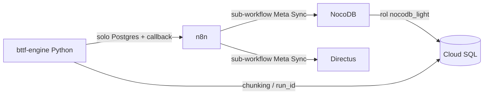

# NocoDB en COLLAPS — Despliegue y mantención

| Atributo | Valor |
|---|---|
| Proyecto GCP | `collaps-prod` |
| Región | `us-central1` |
| Servicio Cloud Run | `nocodb-service` |
| Base de datos | Cloud SQL PostgreSQL 15, instancia `bim-saas-db`, base `collaps` |
| Última actualización | 29 de julio de 2026 |

> La gestión de **Cloud Run** (escalado, CPU, memoria, timeout) y la **autorización SQL** (usuarios, redes, Cloud SQL Auth) se opera **directamente desde la consola de Google Cloud / `gcloud`**, no desde el motor Python ni desde n8n.

---

## 1. Resumen ejecutivo

### El problema que resuelve esta arquitectura

NocoDB materializa un registro de metadatos por cada columna de cada tabla que introspecciona. El modelo de datos BIM de COLLAPS usa una tabla por categoría con un parámetro por columna, lo que produce esquemas extremadamente anchos:

- **27.697 columnas** en un solo proyecto  
- de las cuales **27.007** viven en **68 tablas** `b_2_*`

Eso se traducía en unos **80.000 inserts secuenciales** durante el *Initial Meta Sync*. El proceso nunca alcanzaba a completarse.

NocoDB **no ofrece ningún filtro** para excluir tablas al conectar una fuente PostgreSQL. La única unidad de alcance que respeta es el **esquema**.

### El principio de la solución

> El control se ejerce en **PostgreSQL**, no en NocoDB.

NocoDB descubre tablas y columnas consultando `information_schema`. Ese catálogo solo expone objetos sobre los que el usuario conectado tiene algún privilegio.

Conectando NocoDB con un rol restringido (`nocodb_light`) en lugar de `postgres`, **lo que ese rol no puede ver simplemente no existe para NocoDB**:

- Sin vistas  
- Sin esquemas espejo  
- Sin duplicar datos  
- Sin modificar el modelo de negocio  

**Resultado medido:** reducción de **~40×** en columnas expuestas. El sync pasó de no terminar nunca a completarse en **segundos**.

---

## 2. Modelo de datos: las cuatro series

Las tablas de cada esquema tenant se organizan en cuatro series:

| Serie | Contenido | Visibilidad en NocoDB |
|---|---|---|
| **A** | Requerimientos (el usuario, desde NocoDB) | Visible y editable |
| **B** | Datos recibidos del modelo BIM (`b_2_*`) | **Ocultas** |
| **C** | Tablas de cruce y de trabajo (`c_results_*`, `w_table_*`, …) | Visible y editable |
| **D** | Muestras y resultados | Visible y editable |

---

## 3. Infraestructura

### 3.1 Cloud Run — `nocodb-service`

Configuración operativa (consola GCP / `gcloud`):

```bash
gcloud run services update nocodb-service \
  --region=us-central1 \
  --min-instances=0 \
  --max-instances=1 \
  --cpu=1 \
  --memory=2Gi \
  --cpu-throttling \
  --cpu-boost \
  --timeout=3600
```

| Aspecto | Valor típico |
|---|---|
| Costo estimado | US$5 – US$20 / mes |
| Cold start | 20 – 60 s en el primer acceso del día |
| Implicación | Los syncs de meta desde n8n deben tolerar timeouts largos y reintentos (ver [Sync de visores](../orquestador/sync-visores.md)) |

### 3.2 Variables de entorno

Despliegue con `gcloud` (delimitador personalizado `@@` porque `NC_DB` contiene comas):

```bash
gcloud run services update nocodb-service \
  --region=us-central1 \
  --set-env-vars="^@@^NC_DB=pg://USER:PASSWORD@HOST:5432?d=collaps@@NC_AUTH_JWT_SECRET=YOUR_SECRET"
```

> Usa placeholders. Los secretos reales viven en Secret Manager / consola GCP, nunca en Git.

---

## 4. Estrategia de exposición

Reglas vigentes en `public.politica_exposicion`:

| Patrón | Modo | Prioridad |
|---|---|---|
| `b\_2\_%` | oculta | 50 |
| `directus\_%` | oculta | 50 |
| `%` | edicion | 999 |

Interpretación: por defecto las tablas son editables; las series BIM crudas (`b_2_*`) y metadatos Directus quedan ocultas al rol de NocoDB.

### Aplicación de privilegios a `nocodb_light`

PostgreSQL actualiza los privilegios del rol restringido mediante funciones de exposición (runbook operativo):

| Función | Alcance |
|---|---|
| `aplicar_exposicion()` | Aplica la política de exposición al esquema / contexto actual |
| `aplicar_exposicion_todos()` | Recorre los tenants/esquemas y sincroniza privilegios de `nocodb_light` según `politica_exposicion` |

Tras cambiar reglas en `politica_exposicion`, ejecuta estas funciones (como superusuario / rol de administración) para que `information_schema` refleje el nuevo alcance **antes** de disparar un Meta Sync en NocoDB.

```sql
-- Ejemplo conceptual (ajusta firma real según tu DDL de funciones)
SELECT aplicar_exposicion();
-- o, para todos los esquemas tenant:
SELECT aplicar_exposicion_todos();
```

---

## 5. Runbook: despliegue desde cero

Orden recomendado (operación en consola GCP + SQL):

1. **Cloud SQL** — instancia `bim-saas-db`, base `collaps`, PostgreSQL 15 lista.  
2. **Rol `nocodb_light`** — crear usuario/rol con privilegios mínimos; **no** usar `postgres` como data source de NocoDB.  
3. **Política** — poblar `public.politica_exposicion` con las reglas de la §4.  
4. **Aplicar exposición** — ejecutar `aplicar_exposicion()` / `aplicar_exposicion_todos()` para materializar GRANT/REVOKE sobre `nocodb_light`.  
5. **Cloud Run** — desplegar/actualizar `nocodb-service` con CPU/memoria/timeout de la §3.1.  
6. **Env vars** — configurar `NC_DB` (apuntando a `nocodb_light`) y `NC_AUTH_JWT_SECRET` vía `gcloud` / Secret Manager.  
7. **Data source en NocoDB** — conectar el schema tenant por **IP pública** (ver limitaciones).  
8. **Meta Sync** — lanzar sync (UI o sub-workflow n8n [Sync de visores](../orquestador/sync-visores.md)).  
9. **Verificar** — series A/C/D visibles; `b_2_*` ausentes del catálogo NocoDB.

---

## 11. Limitaciones conocidas

| Limitación | Detalle |
|---|---|
| Columnas del pipeline | **No** se pueden agregar columnas a tablas del pipeline desde NocoDB. Es una limitación estructural de PostgreSQL / modelo COLLAPS (el esquema lo gobierna el motor y las migraciones, no el visor). |
| Socket Unix | La conexión por **socket Unix** no funciona para data sources de NocoDB. Usar **IP pública** (autorizada en Cloud SQL). |
| Cold start | Con `min-instances=0`, el primer sync del día puede tardar; el workflow n8n usa timeout 120s + retries. |
| Alcance | NocoDB no filtra tablas individualmente: el filtro real es el privilegio del rol en PostgreSQL. |

---

## Relación con el resto de COLLAPS



- El motor Python **no** registra colecciones ni habla con NocoDB/Directus.  
- La introspección de visores la orquesta n8n → [Sync de visores](../orquestador/sync-visores.md).  
- Detalle de exposición y costos: este documento.
