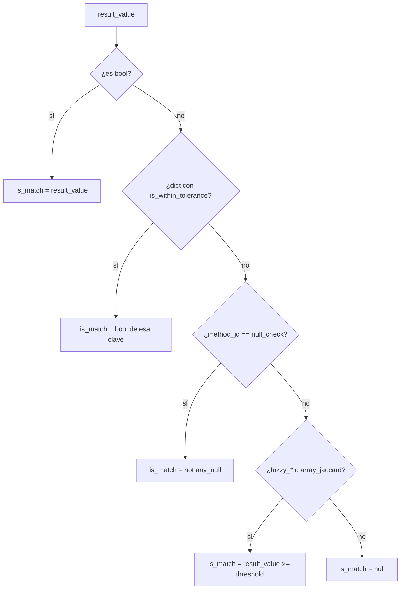

# Conceptos base — `collaps_engine`

Esta sección explica, en lenguaje claro, cómo piensa el motor matemático de COLLAPS. Es la base para entender cualquier método del catálogo.

## Explicación en lenguaje humano

Imagina que ya cruzaste dos tablas (por ejemplo, un **modelo BIM** y un **contrato**). Para cada fila emparejada, el motor toma **un valor de la columna A** y **un valor de la columna B** y les aplica una operación: restar cantidades, comparar textos, medir si dos fechas están cerca, etc.

Esa operación siempre recibe cuatro ideas:

| Idea | En código | En la práctica |
|---|---|---|
| Valor del lado A | `val_a` | Lo que hay en la columna A de esa fila |
| Valor del lado B | `val_b` | Lo que hay en la columna B de esa fila |
| Qué operación usar | `method_id` | Ej.: `math_sub`, `fuzzy_levenshtein` |
| Ajustes opcionales | `options` | Umbrales, tolerancias, patrones… |

El motor responde siempre con el mismo “sobre” de resultado: el valor calculado, si considera que “hace match”, y si hubo error.

---

## Punto de entrada

```python
from collaps_engine import execute_transformation

result = execute_transformation(val_a, val_b, method_id, options={})
```

| Parámetro | Tipo | Rol |
|---|---|---|
| `val_a` | `Any` | Valor del lado A (columna A de la fila actual tras el JOIN) |
| `val_b` | `Any` | Valor del lado B (columna B de la fila actual) |
| `method_id` | `str` | Clave en `OPERATIONS_REGISTRY` (p. ej. `math_sub`, `strict_equal`) |
| `options` | `dict` \| omitido | Parámetros opcionales (`threshold`, `epsilon`, `pattern`, …) |

### De dónde salen `val_a` y `val_b` en el orquestador

Tras el `FULL OUTER JOIN`, `AnalysisEngine` lee por fila las columnas `{columna}_a` / `{columna}_b` del SQL, aplica `df.apply`, y materializa bloques indexados `{i}_{col}A` / `{i}_{col}B` / `{i}_{method}` en la tabla destino.

**Hoy el HTTP `AnalysisPayload` (camelCase: `columnsA`, `calculationMethods`, …) no transporta `options`**: el orquestador llama con `options={}` (defaults). Las `options` documentadas aplican a uso directo del engine o a evoluciones futuras del contrato.

---

## Respuesta estándar

```json
{
  "method_id": "fuzzy_levenshtein",
  "result_value": 0.87,
  "is_match": true,
  "metadata": { "options": { "threshold": 0.85 } },
  "error": null
}
```

| Campo | Tipo | Descripción humana |
|---|---|---|
| `method_id` | `str` | Qué operación se ejecutó |
| `result_value` | `Any` | El número, sí/no, lista o detalle que produjo el cálculo |
| `is_match` | `bool` \| `null` | Cuando aplica: “¿estos dos valores se consideran coincidentes?” |
| `metadata` | `dict` | Copia de las opciones usadas |
| `error` | `str` \| `null` | Si algo falló, el mensaje; si no, vacío |

### Errores

| Caso | `result_value` | `is_match` | `error` |
|---|---|---|---|
| `method_id` no registrado | `null` | `null` | `Método no registrado: '...'` |
| Excepción en la operación | `null` | `null` | Mensaje de la excepción |

---

## Diccionario `options`

Ajustes finos por método. Si envías una clave que el método no usa, se ignora (no rompe el cálculo).

| Clave | Métodos | Default | En lenguaje humano |
|---|---|---|---|
| `epsilon` | `math_tolerance` | — | “¿Cuánto pueden diferir en unidades absolutas?” (ej. ±5) |
| `tolerance_pct` | `math_tolerance` | — | “¿Cuánto pueden diferir en %?” (ej. 2%) |
| `threshold` | `fuzzy_*`, `array_jaccard` | `0.85` | “A partir de qué similitud digo que sí coinciden” (0.85 = 85%) |
| `pattern` | `regex_match` | `val_b` | La expresión regular a buscar |
| `ignore_case` | `regex_match` | `false` | Ignorar mayúsculas/minúsculas |
| `tolerance_seconds` | `date_tolerance` | `0` | Ventana de tiempo permitida en segundos |
| `operator` | `boolean_logic` | `"AND"` | Combinar con Y / O / XOR |

---

## Cómo se calcula `is_match`

No todos los métodos contestan “sí/no coincide”. Una resta (`math_sub`) solo da un número; una igualdad (`strict_equal`) sí da un booleano.



| Condición | `is_match` |
|---|---|
| `result_value` es `bool` | Igual a ese booleano |
| Dict con `is_within_tolerance` | `true` / `false` según esa clave |
| `null_check` | `true` solo si **ninguno** es null |
| `fuzzy_levenshtein`, `fuzzy_jaro_winkler`, `array_jaccard` | `true` si el score ≥ `threshold` (default 0.85) |
| Resto (`math_add`, diffs, listas…) | `null` — no hay semántica de match |

### Persistencia en `AnalysisEngine`

Para métodos *boolean-pure*, el orquestador **no** crea columna extra `is_match__...` (el propio resultado ya indica el match).

Métodos boolean-pure:

`strict_equal`, `normalized_equal`, `date_equal`, `regex_match`, `null_check`, `boolean_logic`, `contains_check`

Para el resto, si `is_match` no es siempre `null`, se añade `is_match__{result_col}`.

---

## Catálogo `OPERATIONS_REGISTRY` (21 métodos)

| Grupo | method_id | Documento |
|---|---|---|
| Numéricas (6) | `math_add`, `math_sub`, `math_diff_abs`, `math_diff_pct`, `math_tolerance`, `math_ratio` | [Numéricas](numericas.md) |
| Texto (6) | `strict_equal`, `normalized_equal`, `fuzzy_levenshtein`, `fuzzy_jaro_winkler`, `contains_check`, `regex_match` | [Texto](texto.md) |
| Fechas (4) | `date_diff_seconds`, `date_diff_days`, `date_equal`, `date_tolerance` | [Fechas](fechas.md) |
| Listas (3) | `array_intersection`, `array_difference`, `array_jaccard` | [Listas](listas.md) |
| Lógica (2) | `null_check`, `boolean_logic` | [Lógica](logica.md) |

Alias HTTP legacy (`DIFERENCIA`, `IGUALDAD`) → [Legacy](legacy.md).

---

## Coerción de tipos (helpers internos)

Antes de calcular, el motor a veces “traduce” el valor al tipo que necesita:

| Helper | Comportamiento |
|---|---|
| `_to_float` | Intenta número; si no puede → `null` |
| `_to_str` | Convierte a texto (`None` → `""`) |
| `_normalize_text` | Quita espacios extremos, pasa a minúsculas y elimina acentos |
| `_to_bool` | Interpreta `true`/`1`/`yes`/`si`… como verdadero |
| `_to_list` | Lista, JSON array, o CSV separado por comas |
