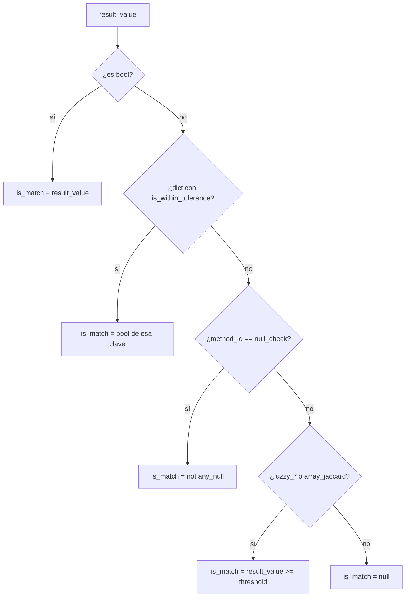

# Conceptos base — `collaps_engine`

API pública y semántica compartida por los **21 métodos** del `OPERATIONS_REGISTRY`.

## Punto de entrada

```python
from collaps_engine import execute_transformation

result = execute_transformation(val_a, val_b, method_id, options={})
```

| Parámetro | Tipo | Rol |
|---|---|---|
| `val_a` | `Any` | Valor del lado A (columna A de la fila actual tras el JOIN) |
| `val_b` | `Any` | Valor del lado B (columna B de la fila actual) |
| `method_id` | `str` | Clave en `OPERATIONS_REGISTRY` (p. ej. `math_sub`, `strict_equal`) |
| `options` | `dict` \| omitido | Parámetros opcionales del método (`threshold`, `epsilon`, `pattern`, …) |

### De dónde salen `val_a` y `val_b` en el orquestador

Tras el `FULL OUTER JOIN`, `AnalysisEngine` lee por fila las columnas `{columna_a}_a` y `{columna_b}_b` y las pasa a `execute_transformation`.  
**Hoy el HTTP `AnalysisPayload` no transporta `options`**: el orquestador llama con `options={}` (defaults). Las `options` documentadas aplican a uso directo del engine / evoluciones futuras del contrato.

---

## Respuesta estándar

```json
{
  "method_id": "fuzzy_levenshtein",
  "result_value": 0.87,
  "is_match": true,
  "metadata": { "options": { "threshold": 0.85 } },
  "error": null
}
```

| Campo | Tipo | Descripción |
|---|---|---|
| `method_id` | `str` | Método ejecutado (eco del argumento) |
| `result_value` | `Any` | Resultado crudo: número, bool, dict, list o `null` |
| `is_match` | `bool` \| `null` | Inferencia de “¿coincide?” cuando aplica |
| `metadata` | `dict` | Siempre incluye `{"options": <options usadas>}` |
| `error` | `str` \| `null` | Mensaje si el método no existe o lanza excepción |

### Errores

| Caso | `result_value` | `is_match` | `error` |
|---|---|---|---|
| `method_id` no registrado | `null` | `null` | `Método no registrado: '...'` |
| Excepción en la operación | `null` | `null` | `str(exc)` |

---

## Diccionario `options`

Contrato informal por método. Claves desconocidas se ignoran (no fallan).

| Clave | Métodos que la usan | Default | Significado |
|---|---|---|---|
| `epsilon` | `math_tolerance` | — | Margen absoluto máximo permitido |
| `tolerance_pct` | `math_tolerance` | — | Margen porcentual máximo |
| `threshold` | `fuzzy_*`, `array_jaccard` | `0.85` | Umbral para inferir `is_match` |
| `pattern` | `regex_match` | `val_b` | Expresión regular |
| `ignore_case` | `regex_match` | `false` | Flag `re.IGNORECASE` |
| `tolerance_seconds` | `date_tolerance` | `0` | Ventana temporal en segundos |
| `operator` | `boolean_logic` | `"AND"` | `AND` \| `OR` \| `XOR` |

---

## Cómo se calcula `is_match`

Lógica en `_infer_is_match` (`collaps_engine/transformer.py`):



| Condición | `is_match` |
|---|---|
| `result_value` es `bool` | Igual a ese booleano |
| Dict con `is_within_tolerance` | `bool(is_within_tolerance)` |
| `null_check` | `True` si **ninguno** es null (`not any_null`) |
| `fuzzy_levenshtein`, `fuzzy_jaro_winkler`, `array_jaccard` | `result_value >= options.threshold` (default `0.85`) |
| Resto (p. ej. `math_add`, diffs, intersecciones) | `null` — no hay semántica de match |

### Persistencia en `AnalysisEngine`

Para métodos en `_BOOLEAN_PURE_METHODS`, el orquestador **no** crea columna extra `is_match__...` (el propio `result_value` ya es el indicador, o el dict de `null_check`).

Métodos boolean-pure:

`strict_equal`, `normalized_equal`, `date_equal`, `regex_match`, `null_check`, `boolean_logic`, `contains_check`

Para el resto, si `is_match` no es siempre `null`, se añade columna `is_match__{result_col}`.

---

## Catálogo `OPERATIONS_REGISTRY` (21 métodos)

| Grupo | method_id | Documento |
|---|---|---|
| Numéricas (6) | `math_add`, `math_sub`, `math_diff_abs`, `math_diff_pct`, `math_tolerance`, `math_ratio` | [Numéricas](numericas.md) |
| Texto (6) | `strict_equal`, `normalized_equal`, `fuzzy_levenshtein`, `fuzzy_jaro_winkler`, `contains_check`, `regex_match` | [Texto](texto.md) |
| Fechas (4) | `date_diff_seconds`, `date_diff_days`, `date_equal`, `date_tolerance` | [Fechas](fechas.md) |
| Listas (3) | `array_intersection`, `array_difference`, `array_jaccard` | [Listas](listas.md) |
| Lógica (2) | `null_check`, `boolean_logic` | [Lógica](logica.md) |

Alias HTTP legacy (`DIFERENCIA`, `IGUALDAD`) no viven en el registry: se resuelven en el orquestador → [Legacy](legacy.md).

---

## Coerción de tipos (helpers internos)

| Helper | Comportamiento |
|---|---|
| `_to_float` | `float(value)`; `None` si no convertible; `bool` → `0.0/1.0` |
| `_to_str` | `str(value)`; `None` → `""` |
| `_normalize_text` | trim + lower + strip diacríticos (NFKD) |
| `_to_bool` | bool nativo; números ≠0; strings `true/1/yes/si/...` |
| `_to_list` | list/tuple; JSON array en string; CSV; si no, `[value]` |
