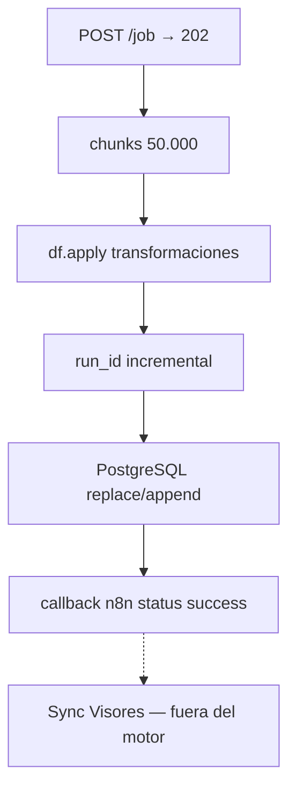

# FastAPI / AnalysisEngine

Orquestador HTTP **bttf-engine** tras el desacoplamiento de CMS.

## Servicio

| Atributo | Valor |
|---|---|
| Título | `Condenser CORE` |
| Routers | `/api/v1/condenser` + `/api/v1/worktables` |
| Salida HTTP del job | Solo `callbackUrl` → n8n |

**Ya no** existen métodos de auto-registro Directus/NocoDB ni variables `DIRECTUS_*` en el motor.

---

## `POST /api/v1/condenser/job`

| Propiedad | Valor |
|---|---|
| Body | `AnalysisPayload` (camelCase) |
| Éxito | `202 Accepted` |
| Background | `AnalysisEngine.run(job_id)` |

### Respuesta `202`

```json
{
  "status": "accepted",
  "jobId": "550e8400-e29b-41d4-a716-446655440000",
  "analysisId": "n8n_1722096123456",
  "message": "Analysis job queued successfully"
}
```

---

## Responsabilidad del motor (100% datos)



| Capacidad | Estado |
|---|---|
| Chunking 50k anti-OOM | ✅ |
| `run_id` int por job | ✅ |
| Columnas indexadas + metadatos al final | ✅ |
| Callback camelCase | ✅ |
| Registro Directus / NocoDB | ❌ eliminado |

### Flag `updateSchema` (notificación de esquemas)

| Momento | Valor |
|---|---|
| `__init__` / inicio de `run()` | `update_schema = False` |
| Tabla destino **nueva** (`if_exists="replace"`) | → `True` |
| `_auto_migrate_table()` añade columnas | → `True` |
| Solo append sin DDL | permanece `False` |

### Callback (webhook a n8n)

```json
{
  "status": "success",
  "analysisId": "...",
  "schema": "s00001_incancer",
  "targetTable": "c_results_precioFrutas",
  "updateSchema": true,
  "filas_insertadas": 120,
  "jobId": "...",
  "summary": {
    "totalRows": 120,
    "matches": 100,
    "onlyA": 12,
    "onlyB": 8,
    "hasDuplicates": false
  }
}
```

n8n usa `updateSchema` como **guardia de tráfico**: solo si es `true` invoca el [Sync de visores](sync-visores.md). Detalle del contrato: [Payload y contratos](payload-y-contratos.md#callback-asíncrono-post-a-callbackurl).

---

## WorkTables

`POST /api/v1/worktables/create` — misma filosofía: Postgres + callback; sin CMS.  
Ver [WorkTables](worktables.md).

## Configuración

| Variable | Obligatoria | Rol |
|---|---|---|
| `DATABASE_URL` | Sí | PostgreSQL |
| `GCS_BUCKET_NAME` | No | `/upload` |
| `PORT` | No | Default 8080 |

No se configuran URLs ni tokens de Directus/NocoDB en este servicio.

## Ver también

- [Payload y contratos](payload-y-contratos.md)  
- [Sync de visores](sync-visores.md)  
- [NocoDB](../infraestructura/nocodb.md)
