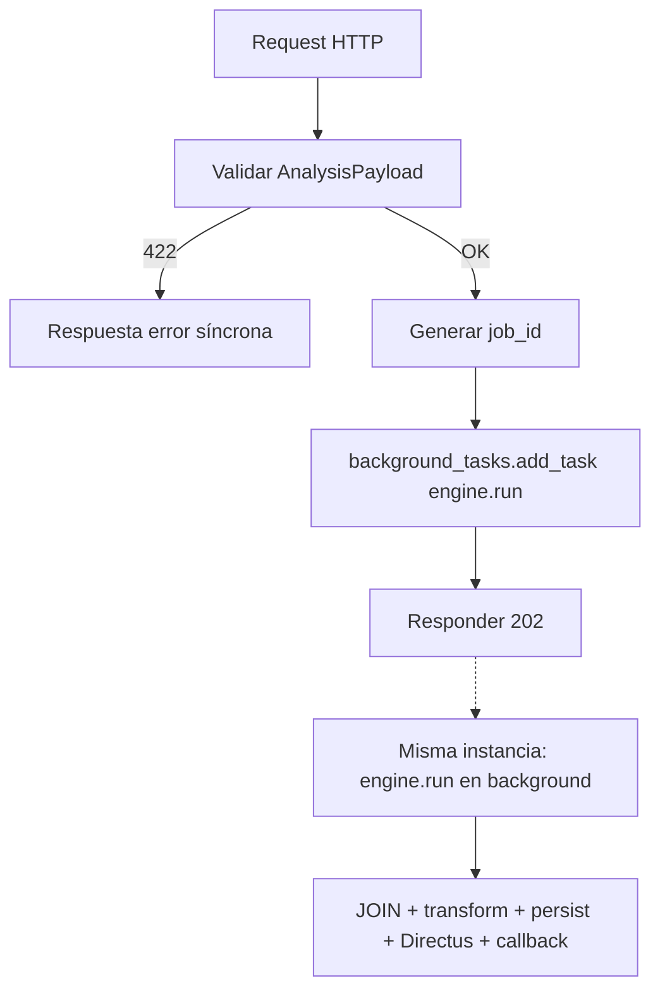

# FastAPI / AnalysisEngine

Documentación del orquestador HTTP **Condenser CORE** y del motor de jobs `AnalysisEngine`.

## Servicio

| Atributo | Valor |
|---|---|
| Título OpenAPI | `Condenser CORE` |
| Descripción | Motor asíncrono de procesamiento de datos — Módulo C (Collpaps BIM-OS) |
| Versión | `0.1.0` |
| Entrada | `main.py` → incluye router `condenser` |
| UI estática | Montada en `/app` (`static/`); `/` redirige a `/app` |

```python
# main.py (esqueleto)
app = FastAPI(title="Condenser CORE", version="0.1.0")
app.include_router(condenser_router)  # prefix /api/v1/condenser
app.mount("/app", StaticFiles(directory="static", html=True), name="static")
```

---

## Endpoint principal: `POST /api/v1/condenser/job`

| Propiedad | Valor |
|---|---|
| Método / ruta | `POST /api/v1/condenser/job` |
| Handler | `create_analysis_job` en `app/api/endpoints.py` |
| Body | `AnalysisPayload` (JSON) |
| Éxito | `202 Accepted` |
| Validación fallida | `422 Unprocessable Entity` (FastAPI + Pydantic) |

### Comportamiento del handler

```python
job_id = str(uuid4())
engine = AnalysisEngine(payload)
background_tasks.add_task(engine.run, job_id)

return JSONResponse(
    status_code=202,
    content={
        "status": "accepted",
        "job_id": job_id,
        "analysis_id": payload.analysis_id,
        "message": "Análisis encolado exitosamente",
    },
)
```

### Respuesta `202`

```json
{
  "status": "accepted",
  "job_id": "550e8400-e29b-41d4-a716-446655440000",
  "analysis_id": "n8n_1722096123456",
  "message": "Análisis encolado exitosamente"
}
```

| Campo | Tipo | Notas |
|---|---|---|
| `status` | string | Siempre `"accepted"` en este camino |
| `job_id` | string (UUID4) | Identificador del encolado; **no** se persiste en una tabla de jobs |
| `analysis_id` | string \| null | Eco de `payload.analysis_id` |
| `message` | string | Mensaje fijo de aceptación |

### Códigos de estado

| Código | Cuándo |
|---|---|
| `202` | Payload válido; task encolada |
| `422` | Fallo de validación Pydantic (campo extra, método inválido, identificador SQL ilegal, etc.) |
| Errores del job en background | **No** se reflejan en la respuesta HTTP del POST (ya se respondió 202) |

---

## Asincronía con `BackgroundTasks`

### Modelo de ejecución



FastAPI ejecuta las tareas de `BackgroundTasks` **después** de enviar la respuesta, en el mismo proceso del worker. Implicaciones:

| Aspecto | Comportamiento actual |
|---|---|
| Cola durable | No — memoria del proceso |
| Reintentos | No automáticos |
| Escalado horizontal | Un job vive en la instancia que lo aceptó |
| Reinicio Cloud Run | Puede abortar jobs en curso |
| Observabilidad de estado | Solo logs + `callback_url` |
| Aislamiento | Un job pesado compite por CPU/memoria con el servidor HTTP |

Esto es suficiente para cargas moderadas y el patrón Wait/resume de n8n, pero **no** sustituye a Celery/Cloud Tasks/Pub-Sub si se necesitan garantías fuertes.

---

## `AnalysisEngine` — ciclo interno

Clase: `app/core/analysis_engine.py`  
Entrada: `AnalysisEngine(payload).run(job_id)`

| Paso | Método / módulo | Acción |
|---|---|---|
| 1 | `run` | Inicializa `run_id`, timestamps |
| 2 | `build_analysis_sql` | Construye SQL `FULL OUTER JOIN` |
| 3 | `_fetch_source_uniqueness_stats` | Warning si llaves no únicas |
| 4 | `_execute_analysis_query` | `pd.read_sql` contra `get_db_engine()` |
| 5 | `_build_analytical_summary` | Conteos Match / Only A / Only B |
| 6 | `_apply_collaps_transformations` | Loop fila × método → `execute_transformation` |
| 7 | `_persist_result` | Metadatos + migración + `to_sql(append)` + PK |
| 8 | `_register_directus_collection` | Registro idempotente en Directus |
| 9 | `_send_callback` | POST a `callback_url` si es HTTP(S) |

### Identificadores: `job_id` vs `run_id`

| ID | Origen | Uso |
|---|---|---|
| `job_id` | Endpoint (`uuid4`) | Trazabilidad del encolado en logs / respuesta 202 |
| `run_id` | Generado dentro de `run` (`uuid4`) | Columna persistida en cada fila de resultado; distingue re-ejecuciones |

### Callback de finalización

Si `payload.callback_url` comienza por `http://` o `https://`:

```json
{
  "status": "success | failed",
  "analysis_id": "<payload.analysis_id>",
  "schema": "<payload.schema_name>",
  "summary": {
    "total_rows": 0,
    "matches": 0,
    "only_a": 0,
    "only_b": 0,
    "has_duplicates": false
  }
}
```

Fallos al notificar se registran en log y **no** revierten la persistencia ya realizada.

---

## Endpoint auxiliar: `POST /api/v1/condenser/upload`

Fuera del flujo BTTF principal, pero parte del mismo router.

| Campo | Tipo | Descripción |
|---|---|---|
| `file` | multipart file | Archivo a subir |
| `project_id` | form | Prefijo de ruta |
| `subfolder` | form | Default `"docs"` |

Respuesta:

```json
{ "status": "success", "gcs_path": "gs://... o local://data/..." }
```

`StorageManager` intenta GCS (`GCS_BUCKET_NAME`); si falla, guarda en `data/` local.

---

## Dependencias de configuración (orquestación)

| Variable | Obligatoria para `/job` | Rol |
|---|---|---|
| `DATABASE_URL` | Sí | Engine SQLAlchemy; sin ella el análisis falla en ejecución |
| `GCS_BUCKET_NAME` | No | Solo `/upload` (default `bim-saas-storage-collaps-prod`) |
| `PORT` | No | Puerto Uvicorn (Cloud Run, default 8080) |

Credenciales Directus **no** vienen de env: se leen de `public.portal_projects` en tiempo de ejecución.

---

## Límites y deuda del orquestador

1. No existe `GET /api/v1/condenser/job/{job_id}`.
2. `get_db_engine()` usa `@lru_cache`: rotar `DATABASE_URL` requiere reiniciar el proceso.
3. Transformaciones en Python fila a fila (no vectorizadas): coste crece con filas × pares.
4. UI en `/app` no está alineada al contrato `AnalysisPayload` actual.
5. `bttf_engine.CondenserEngine` es legacy y no está expuesto por el router.

## Ver también

- [Payload y contratos](payload-y-contratos.md)
- [Flujo end-to-end](../arquitectura/flujo-end-to-end.md)
- [Integración n8n](integracion-n8n.md)
