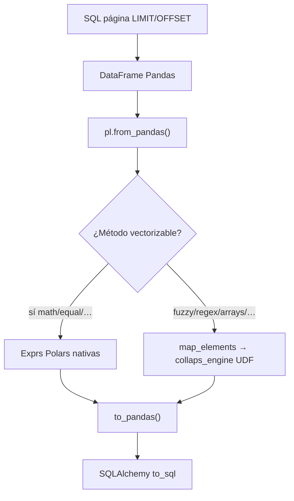

# FastAPI / AnalysisEngine

Orquestador HTTP **bttf-engine** — Release Stable (motor híbrido Pandas/Polars).

## Servicio

| Atributo | Valor |
|---|---|
| Título | `Condenser CORE` |
| Routers | `/api/v1/condenser` + `/api/v1/worktables` |
| Transformaciones | `app/core/polars_transformer.py` |
| Salida HTTP del job | `callbackUrl` → n8n |

---

## `POST /api/v1/condenser/job`

| Propiedad | Valor |
|---|---|
| Body | `AnalysisPayload` (camelCase) |
| Éxito | `202 Accepted` |
| Background | `AnalysisEngine.run(job_id)` |

```json
{
  "status": "accepted",
  "jobId": "550e8400-e29b-41d4-a716-446655440000",
  "analysisId": "n8n_1722096123456",
  "message": "Analysis job queued successfully"
}
```

> El trabajo real corre **después** del `202`. En Cloud Run es **obligatorio** `--no-cpu-throttling` para que esa fase tenga CPU. Ver [Cloud Run](../despliegue/cloud-run.md).

---

## Motor híbrido Pandas ↔ Polars



| Paso | Módulo / API |
|---|---|
| Lectura | `pd.read_sql` + conexión corta |
| Puente in | `pl.from_pandas` |
| Cómputo | Polars exprs / `map_elements` |
| Puente out | `to_pandas()` (+ **pyarrow** en deps) |
| Orquestación | `AnalysisEngine._apply_collaps_transformations` → `transform_chunk_with_polars` |

Métodos con path vectorizado típico: `math_*`, `strict_equal`, `normalized_equal`, `date_equal`, `boolean_logic`.  
UDFs (fuzzy, regex, arrays, tolerancia, …): `execute_transformation` vía `map_elements`.

---

## QueryBuilder: aliases indexados

`build_analysis_sql` emite por cada par:

```sql
a."cantidad" AS "0_cantidad_a",
b."cantidad" AS "0_cantidad_b",
a."cantidad" AS "1_cantidad_a",  -- misma columna, segundo par: sin colisión
b."precio"   AS "1_precio_b"
```

Helper: `sql_source_column_alias(pair_index, col_name, side)` → `{index}_{col}_{side}`.

Tras Polars, las columnas persistidas usan el esquema de resultado (`0_cantidadA`, `0_math_sub`, …).

---

## Separación lectura / cómputo / escritura

| Fase | Conexión SQL |
|---|---|
| `LIMIT/OFFSET` página | Corta |
| Transform Polars | **Ninguna** |
| Persist / migrate | Corta |

`SQL_CHUNK_SIZE` (recomendado `10000`).

## Pool SQL fail-fast

`pool_size = (DB_POOL_CPU_COUNT * 2) + DB_POOL_DISK_COUNT`, `max_overflow=0`, `pool_timeout=5`.

---

## `updateSchema` + callback

Inicializado en `False`. Pasa a `True` solo si:

1. Se crea tabla nueva (`if_exists="replace"`), o  
2. `_auto_migrate_table()` añade columnas.

Webhook: `status`, `schema`, `targetTable`, `updateSchema`, `filas_insertadas`, `jobId`, `summary` — ver [Payload](payload-y-contratos.md).

---

## WorkTables

Mismo aislamiento CMS. Pendiente replicar patrón `updateSchema` en `worktable_engine.py` → [WorkTables](worktables.md).

## Configuración

| Variable | Prod | Rol |
|---|---|---|
| `DATABASE_URL` | VPC/privada preferible | PostgreSQL |
| `SQL_CHUNK_SIZE` | `10000` | Página |
| `DB_POOL_CPU_COUNT` | `2` | Pool |
| `DB_POOL_DISK_COUNT` | `1` | Pool |

## Ver también

- [Integración n8n](integracion-n8n.md)  
- [Cloud Run](../despliegue/cloud-run.md)  
- [Variables de entorno](../despliegue/variables-entorno.md)
