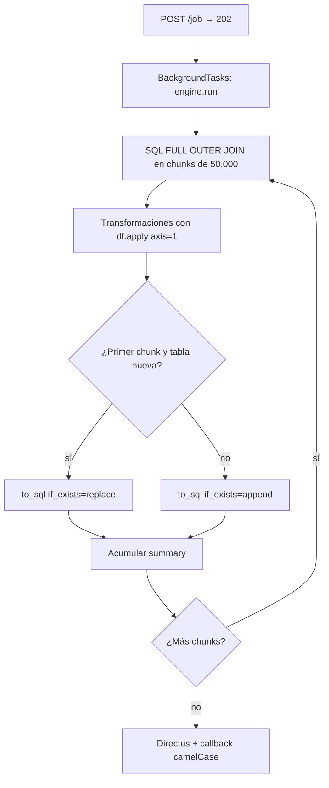

# FastAPI / AnalysisEngine

Orquestador HTTP **Condenser CORE** y motor de jobs `AnalysisEngine` tras el Refactor Core.

## Servicio

| Atributo | Valor |
|---|---|
| Título OpenAPI | `Condenser CORE` |
| Versión | `0.1.0` |
| Routers | `/api/v1/condenser` + `/api/v1/worktables` |
| UI estática | `/app` |

```python
app.include_router(condenser_router)   # /api/v1/condenser
app.include_router(worktable_router)   # /api/v1/worktables
```

---

## Endpoint principal: `POST /api/v1/condenser/job`

| Propiedad | Valor |
|---|---|
| Handler | `create_analysis_job` |
| Body | `AnalysisPayload` (JSON **camelCase**) |
| Éxito | `202 Accepted` |
| Validación | `422` |

### Respuesta `202` (camelCase)

```json
{
  "status": "accepted",
  "jobId": "550e8400-e29b-41d4-a716-446655440000",
  "analysisId": "n8n_1722096123456",
  "message": "Analysis job queued successfully"
}
```

```python
background_tasks.add_task(engine.run, job_id)
```

El trabajo pesado corre en `BackgroundTasks` del mismo proceso (no es una cola durable).

---

## Asincronía y rendimiento (Anti-OOM)



| Mejora | Detalle |
|---|---|
| Chunking | `SQL_CHUNK_SIZE = 50_000` vía `pd.read_sql(..., chunksize=...)` |
| Persistencia | Primer chunk en tabla nueva → `replace`; resto → `append` |
| Vectorización | `df.apply(..., axis=1)` — **sin** `iterrows()` |
| Summary | Se acumula chunk a chunk (`totalRows`, `matches`, `onlyA`, `onlyB`) |
| `run_id` | Entero `MAX(run_id)+1`, calculado **una vez** por job y reutilizado en todos los chunks |

---

## Ciclo interno de `AnalysisEngine.run`

| Paso | Acción |
|---|---|
| 1 | Asigna `job_id` (UUID) y timestamp UTC |
| 2 | `build_analysis_sql` → FULL OUTER JOIN |
| 3 | Stats de unicidad de llaves (warning si no son únicas) |
| 4 | Itera chunks de 50k filas |
| 5 | Por chunk: `df.apply` + columnas indexadas `{i}_colA` / `{i}_método` |
| 6 | Reordena metadatos al final; persiste; acumula summary |
| 7 | Auto-registro Directus (idempotente) |
| 8 | Callback HTTP a `callbackUrl` |

### `jobId` vs `run_id`

| ID | Tipo | Rol |
|---|---|---|
| `jobId` | UUID string | Encolado HTTP + campo `job_id` en filas + callback |
| `run_id` | int incremental | Corrida de negocio por tabla destino; compartido entre chunks |

### Callback

```json
{
  "status": "success",
  "analysisId": "...",
  "schema": "s00001_incancer",
  "jobId": "...",
  "summary": {
    "totalRows": 120,
    "matches": 100,
    "onlyA": 12,
    "onlyB": 8,
    "hasDuplicates": false
  }
}
```

---

## Endpoint auxiliar: `POST /api/v1/condenser/upload`

Multipart → GCS (o fallback local). Sin cambios de contrato camelCase en el body form.

---

## Endpoint hermano: WorkTables

`POST /api/v1/worktables/create` — materializa tablas de trabajo agrupadas. Ver [WorkTables](worktables.md).

---

## Configuración

| Variable | Obligatoria para `/job` | Rol |
|---|---|---|
| `DATABASE_URL` | Sí | Engine SQLAlchemy |
| `GCS_BUCKET_NAME` | No | Solo `/upload` |
| `PORT` | No | Default `8080` |

## Límites

1. Sin `GET /job/{id}` — solo callback.  
2. `BackgroundTasks` ≠ cola distribuida.  
3. `@lru_cache` en `get_db_engine()` — rotar URL exige redeploy.  
4. UI estática `/app` puede quedar desalineada del contrato camelCase.

## Ver también

- [Payload y contratos](payload-y-contratos.md)
- [Integración n8n](integracion-n8n.md)
- [Flujo end-to-end](../arquitectura/flujo-end-to-end.md)
