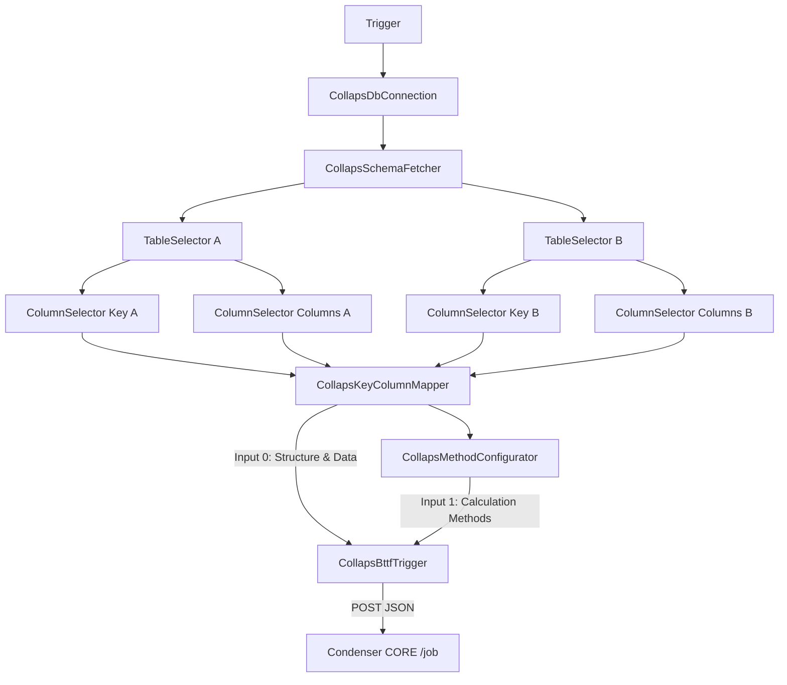

# Integración n8n

Cómo el paquete `n8n-nodes-collaps` descubre metadatos en PostgreSQL, ensambla el `AnalysisPayload` y lo envía al orquestador Condenser CORE.

## Pipeline de nodos



`CollapsDataWatcher` puede intercalarse tras un Table/Column Selector para inspeccionar filas (`SELECT * LIMIT 10`) sin alterar el contrato.

---

## Qué aporta cada nodo

### 1. `CollapsDbConnection`

Valida la conexión PostgreSQL y emite credenciales aguas abajo (`host`, `port`, `database`, `user`, `password`, `status: "CONNECTED"`).

### 2. `CollapsSchemaFetcher`

Lista schemas reales (`pg_catalog.pg_namespace`, con fallback a `information_schema`) y fija:

```json
{ "schema": "s00001_incancer", "selectedSchema": "s00001_incancer", "schemas": ["..."], "totalSchemas": 12 }
```

### 3. `CollapsTableSelector` (×2)

Por tabla (A y B):

```json
{ "schema": "s00001_incancer", "tableName": "modelo" }
```

### 4. `CollapsColumnSelector` (×4)

Cuatro instancias alimentan el mapper:

| Rama | Rol | Salida típica |
|---|---|---|
| Key A | Llave de cruce tabla A | `{ schema, tableName, columns: ["codigo"] }` |
| Columns A | Columnas de análisis A | `{ schema, tableName, columns: ["cantidad","precio"] }` |
| Key B | Llave de cruce tabla B | `{ schema, tableName, columns: ["codigo"] }` |
| Columns B | Columnas de análisis B | `{ schema, tableName, columns: ["cantidad","precio"] }` |

### 5. `CollapsKeyColumnMapper`

Fusiona las 4 ramas y construye el núcleo del payload.

**`bttfPayload` emitido (campos exactos):**

| Campo | Cómo se obtiene |
|---|---|
| `source` | Hardcoded `"n8n"` |
| `analysis_id` | `` `n8n_${Date.now()}` `` |
| `schema_name` | Schema unificado de las ramas |
| `tabla_a` / `tabla_b` | `tableName` de columnas (fallback a key) |
| `llave_cruce_a` / `llave_cruce_b` | Primera columna de cada Key selector |
| `columnas_a` / `columnas_b` | CSV derivado de `column_pairs[]` |

También emite metadatos de UI:

```json
{
  "bttfPayload": { "...": "..." },
  "column_pairs": [
    { "index": 0, "column_a": "cantidad", "column_b": "cantidad", "pair_label": "CANTIDAD / CANTIDAD" }
  ],
  "key_pair_label": "codigo / codigo",
  "pairing_mode": "manual"
}
```

**Modos de emparejamiento**

| Modo | Comportamiento |
|---|---|
| `manual` | El usuario mapea A→B en el resource mapper |
| `auto` | Empareja por índice hasta `min(len(A), len(B))` |

### 6. `CollapsMethodConfigurator`

Lee `column_pairs[]` y asigna métodos:

| Modo | Comportamiento |
|---|---|
| `global` | Un método para todos los pares (default `math_sub`) |
| `perPair` | Método por etiqueta de par; fallback `strict_equal` |

Emite, entre otros:

```json
{
  "metodos_calculo": "math_sub,strict_equal",
  "method_pairs": [
    {
      "index": 0,
      "pair_label": "CANTIDAD / CANTIDAD",
      "column_a": "cantidad",
      "column_b": "cantidad",
      "method": "math_sub",
      "method_source": "global"
    }
  ],
  "bttfPayload": { "metodos_calculo": "math_sub,strict_equal", "...": "..." }
}
```

Valida que `columnas_a.split(',').length === metodos.length` antes de continuar.

### 7. `CollapsBttfTrigger`

Nodo de dos entradas:

| Input | Contenido esperado |
|---|---|
| Input 0 — *Structure & Data* | Salida del Key & Column Mapper (`bttfPayload`) |
| Input 1 — *Calculation Methods* | Salida del Method Configurator (`metodos_calculo`) |

Parámetros de UI relevantes:

| Parámetro | Campo resultante |
|---|---|
| Analysis Name | `nombre_analisis` (default `"My Analysis"`) |
| Target Table | `tabla_destino` (vía `resolveTablaDestino`) |

**Ensamblado final (código del nodo):**

```typescript
const payloadToSend = {
  ...basePayload,                 // spread de bttfPayload
  metodos_calculo: metodosCalculo,
  nombre_analisis: analysisName,
  tabla_destino: resolveTablaDestino(basePayload.schema_name, targetTable),
};

if (resolvedCallbackUrl) {
  payloadToSend.callback_url = resolvedCallbackUrl;
}
```

`resolveTablaDestino`:

- Si `targetTable` ya contiene `.` → se usa tal cual (el engine luego sanitiza el nombre de tabla).
- Si no → concatena `schema_name + '.' + targetTable`.

---

## Llamada HTTP al orquestador

| Propiedad | Valor en código |
|---|---|
| URL | `https://bttf-engine-31997537275.us-central1.run.app/api/v1/condenser/job` |
| Método | `POST` |
| Headers | `Content-Type: application/json`, `Accept: application/json` |
| Body | `payloadToSend` (JSON plano `AnalysisPayload`) |
| Éxito esperado | HTTP **202** |

El nodo emite al workflow un ítem con `{ request, response }` para depuración.

> La URL del engine está **hardcodeada** en el nodo. Cambiar de entorno implica actualizar el paquete o parametrizar la URL en una evolución futura.

---

## Mapa campo a campo → `AnalysisPayload`

| Campo del contrato | Nodo que lo fija | Origen concreto |
|---|---|---|
| `source` | KeyColumnMapper | `"n8n"` |
| `analysis_id` | KeyColumnMapper | `n8n_<timestamp>` |
| `schema_name` | KeyColumnMapper | Schema de las ramas |
| `tabla_a` / `tabla_b` | KeyColumnMapper | `tableName` |
| `llave_cruce_a` / `llave_cruce_b` | KeyColumnMapper | Primera columna Key A/B |
| `columnas_a` / `columnas_b` | KeyColumnMapper | CSV de `column_pairs` |
| `metodos_calculo` | MethodConfigurator | CSV de métodos resueltos |
| `nombre_analisis` | BttfTrigger | Parámetro UI |
| `tabla_destino` | BttfTrigger | Parámetro UI + `resolveTablaDestino` |
| `callback_url` | BttfTrigger | `$execution.resumeUrl` si existe |

---

## Patrón Wait / `resumeUrl`

El trigger evalúa:

```typescript
this.evaluateExpression('{{ $execution.resumeUrl }}', 0)
```

| Situación | Resultado |
|---|---|
| Hay un Wait de n8n y la expresión resuelve URL | Se envía `callback_url` |
| Expresión vacía / error | No se incluye `callback_url` |

Al terminar el job, el engine hace `POST` al `callback_url` con `{ status, analysis_id, schema, summary }`, lo que permite **reanudar** el workflow n8n sin polling.

Diseño recomendado:

```text
... → MethodConfigurator → Wait (resume on webhook) → BttfTrigger
                                         ↑
                         engine POST callback_url ──┘
```

(La colocación exacta del Wait depende del diseño del workflow; lo crítico es que `$execution.resumeUrl` esté disponible cuando ejecuta el trigger.)

---

## Ejemplo de payload enviado

```json
{
  "source": "n8n",
  "analysis_id": "n8n_1722096123456",
  "schema_name": "s00001_incancer",
  "tabla_a": "modelo",
  "tabla_b": "contrato",
  "llave_cruce_a": "codigo",
  "llave_cruce_b": "codigo",
  "columnas_a": "cantidad,precio",
  "columnas_b": "cantidad,precio",
  "metodos_calculo": "math_sub,strict_equal",
  "nombre_analisis": "Cruce modelo vs contrato",
  "tabla_destino": "s00001_incancer.c_resultado_cruce",
  "callback_url": "https://n8n.example.com/webhook-waiting/..."
}
```

---

## Métodos disponibles en la UI del Method Configurator

Ver tabla completa en [Payload y contratos](payload-y-contratos.md#method_id-canónicos-nodos-n8n). Defaults:

| Contexto | Default |
|---|---|
| Asignación global | `math_sub` |
| Par sin método en modo `perPair` | `strict_equal` |
| Alias legacy expuestos | `DIFERENCIA`, `IGUALDAD` |

---

## Notas de implementación

1. El helper `dynamoMatching.ts` define un shape estructurado `column_comparisons[]`, pero **el POST real no lo usa**; el contrato vigente es el CSV plano.
2. Credenciales por defecto del cliente PG en nodos (host Cloud SQL, user `n8n_user`, database `collaps`) viven en helpers TypeScript; deben tratarse como configuración de entorno, no como secretos de documentación pública en producción.
3. El nodo trigger asume HTTP 202; cualquier otro código debe tratarse como error de integración.

## Ver también

- [Payload y contratos](payload-y-contratos.md)
- [Flujo end-to-end](../arquitectura/flujo-end-to-end.md)
- [Componentes y límites](../arquitectura/componentes-y-limites.md)
