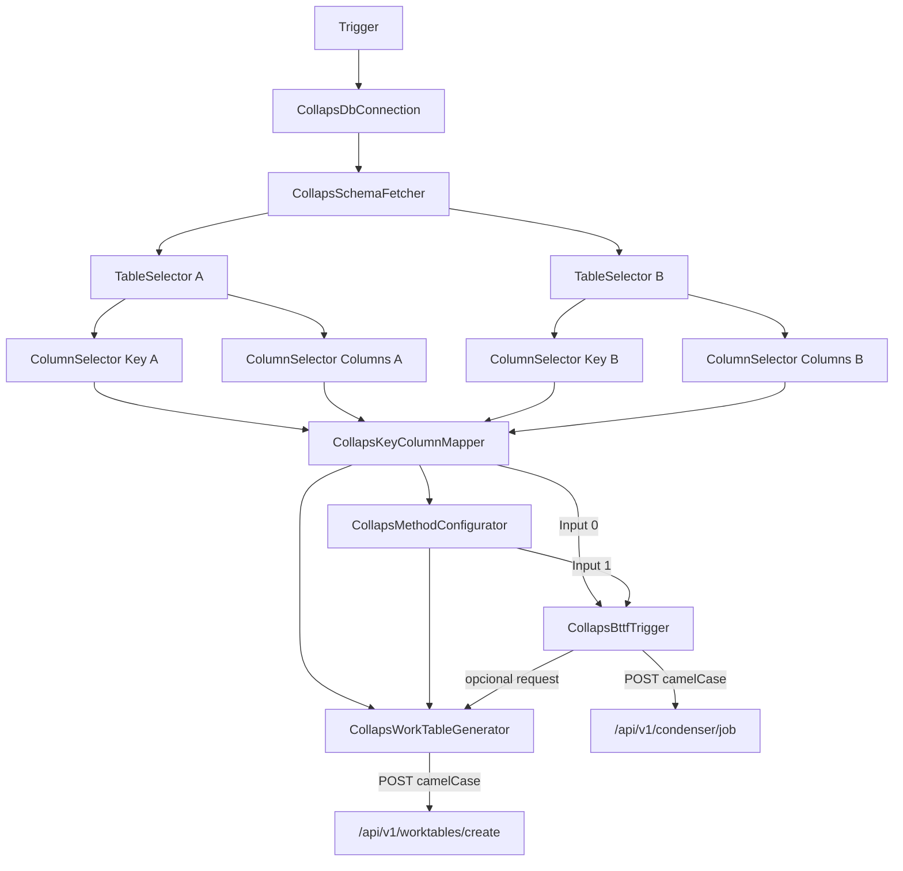

# Integración n8n

Cómo el paquete `n8n-nodes-collaps` construye el contrato **camelCase** hacia Condenser CORE y WorkTables.

## Convención de frontera

| Tramo | Convención |
|---|---|
| Nodos Mapper / Method Configurator (interno) | Aún emiten `bttfPayload` en snake_case legacy (`tabla_a`, …) |
| `CollapsBttfTrigger` / `CollapsWorkTableGenerator` | **Traducen** a camelCase oficial del API |
| Python | Recibe camelCase (`alias_generator=to_camel`) |

El Trigger lee camelCase primero y acepta fallback legacy (`readPayloadString(payload, 'tableA', 'tabla_a')`).

---

## Pipeline de nodos



---

## Condenser: `CollapsBttfTrigger`

| Propiedad | Valor |
|---|---|
| URL | `.../api/v1/condenser/job` |
| UI | Solo **Analysis Name** (ya no se pide tabla destino cruda) |
| `targetTable` | Auto: `buildTargetTableName(analysisName)` → `c_results_<camelCase>` |
| `callbackUrl` | Auto: `$execution.resumeUrl` |

### Payload ensamblado (wire)

```json
{
  "source": "n8n",
  "analysisId": "n8n_1722268400000",
  "schemaName": "s00001_incancer",
  "analysisName": "Precio Frutas",
  "tableA": "modelo",
  "tableB": "contrato",
  "joinKeyA": "codigo",
  "joinKeyB": "codigo",
  "columnsA": "cantidad,precio",
  "columnsB": "cantidad,precio",
  "calculationMethods": "math_sub,strict_equal",
  "targetTable": "c_results_precioFrutas",
  "callbackUrl": "https://n8n.example.com/webhook-waiting/..."
}
```

### Mapa campo → origen

| Campo API | Origen |
|---|---|
| `tableA` / `tableB` / `joinKeyA` / `joinKeyB` / `columnsA` / `columnsB` / `schemaName` / `analysisId` / `source` | Mapper (`bttfPayload`, con traducción en Trigger) |
| `calculationMethods` | Method Configurator |
| `analysisName` | Parámetro UI del Trigger |
| `targetTable` | `tableNameFormatter.buildTargetTableName` |
| `callbackUrl` | `$execution.resumeUrl` |

---

## Helper `tableNameFormatter`

| Función | Prefijo | Ejemplo |
|---|---|---|
| `buildTargetTableName(name)` | `c_results_` | `Precio Frutas` → `c_results_precioFrutas` |
| `buildWorkTableName(name)` | `w_table_` | `Resumen Categoria` → `w_table_resumenCategoria` |

Pipeline de sanitización: quitar acentos → tokens alfanuméricos → camelCase → si empieza por dígito, prefijo `_`.

---

## WorkTables: `CollapsWorkTableGenerator`

| Propiedad | Valor |
|---|---|
| URL | `.../api/v1/worktables/create` |
| Input | `bttfPayload`, o `request` del Trigger, o JSON crudo |
| Source Table | UI: lado `A` o `B` → resuelve nombre de tabla |
| Work Table Name | Amigable → `w_table_<camelCase>` |
| Group By / Order By | UI del nodo |
| `callbackUrl` | `$execution.resumeUrl` |

Contrato API esperado por Python (CSV strings): ver [WorkTables](worktables.md).

Salida del nodo: `{ request, response }` (igual patrón que el Trigger).

---

## Nodos previos (sin cambio de rol)

| Nodo | Rol |
|---|---|
| `CollapsDbConnection` | Valida PG y propaga credenciales |
| `CollapsSchemaFetcher` | Selecciona schema |
| `CollapsTableSelector` / `ColumnSelector` | Descubre tablas/columnas |
| `CollapsKeyColumnMapper` | Arma estructura + `column_pairs` |
| `CollapsMethodConfigurator` | Asigna métodos → CSV de métodos |
| `CollapsDataWatcher` | Debug opcional |

---

## Patrón Wait / resumeUrl

Ambos nodos HTTP (`BttfTrigger`, `WorkTableGenerator`) evalúan:

```typescript
context.evaluateExpression('{{ $execution.resumeUrl }}', 0)
```

Si hay URL, se envía como `callbackUrl`. El motor Condenser responde al terminar con summary camelCase (`totalRows`, `onlyA`, …).

---

## Métodos en Method Configurator

Sin cambio de catálogo (`math_sub`, `fuzzy_levenshtein`, alias `DIFERENCIA` / `IGUALDAD`, …).  
En el wire final viajan dentro de `calculationMethods` (no `metodos_calculo`).

## Ver también

- [Payload y contratos](payload-y-contratos.md)
- [WorkTables](worktables.md)
- [Flujo end-to-end](../arquitectura/flujo-end-to-end.md)
