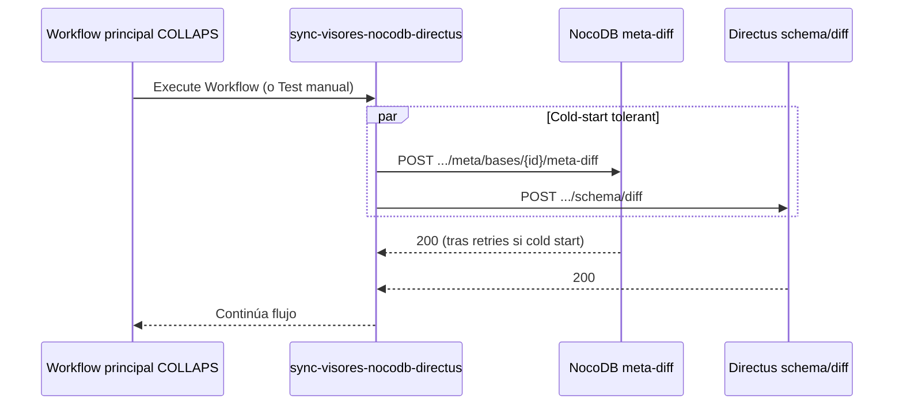

# Sync de visores (NocoDB / Directus)

Sub-workflow n8n que asume la responsabilidad de **actualizar las interfaces visuales** tras el desacoplamiento del motor Python (Separation of Concerns).

| Atributo | Valor |
|---|---|
| Archivo | `workflows/sync-visores-nocodb-directus.json` (repo `collaps-n8n-nodes`) |
| Nombre en n8n | `Sync Visores (NocoDB / Directus)` |
| Rol | Forzar introspección / Meta Sync en NocoDB y Directus |
| Disparo | Manual **o** como sub-workflow (`Execute Workflow`) desde otro flujo |

---

## Por qué existe

Tras el Hito de desacoplamiento:

- `bttf-engine` **solo** escribe en PostgreSQL y notifica a n8n vía `callbackUrl`.  
- **Ya no** llama a Directus ni a NocoDB.  

Por tanto, alguien debe refrescar el catálogo de los visores cuando aparecen tablas nuevas (`c_results_*`, `w_table_*`, etc.). Ese alguien es este sub-workflow.



---

## Arquitectura del flujo

Dos disparadores posibles:

1. **Manual Trigger** — pruebas / sync a demanda.  
2. **Execute Workflow Trigger** — invocación desde el orquestador principal (p. ej. después del callback `status: success` del motor).

Desde cualquiera, salen **en paralelo** dos nodos HTTP Request:

| Nodo | Método | Endpoint (plantilla) | Auth |
|---|---|---|---|
| NocoDB Sync | `POST` | `https://[TU-URL-NOCODB]/api/v2/meta/bases/[TU-BASE-ID]/meta-diff` | Header `xc-token` |
| Directus Sync | `POST` | `https://[TU-URL-DIRECTUS]/schema/diff` | `Authorization: Bearer …` |

Sustituye placeholders por la URL/base/token del entorno (preferible credenciales n8n, no hardcode en prod).

---

## Características críticas (Cold Start Cloud Run)

Los visores viven en Cloud Run con `min-instances=0` (ver [NocoDB](../infraestructura/nocodb.md)). El primer request del día puede tardar **20–60 s**. Por eso ambos nodos HTTP llevan:

| Parámetro | Valor | Motivo |
|---|---|---|
| Timeout | **120.000 ms** (120 s) | Cubrir cold start + meta sync |
| Retry On Fail | **activado** | Reintentar si el contenedor aún no responde |
| Max tries | **3** (intentos totales) | Tolerancia a fallos transitorios |
| Wait between tries | **3.000 ms** | Espacio entre reintentos |

> Sin estos valores, un sync “justo después” del callback del motor fallaría con frecuencia aunque PostgreSQL ya tuviera las tablas.

---

## Dónde encaja en el pipeline COLLAPS

Orden conceptual recomendado:

```text
1. CollapsBttfTrigger / WorkTableGenerator
2. Wait (resumeUrl) ← callback del motor { status: "success", ... }
3. Execute Workflow → Sync Visores (NocoDB / Directus)
4. (Opcional) notificar al usuario / continuar UI
```

El motor **no** espera al sync de visores; n8n lo encadena después del webhook de éxito.

---

## Operación

| Tarea | Acción |
|---|---|
| Importar | Cargar `sync-visores-nocodb-directus.json` en n8n |
| Credenciales | Configurar tokens NocoDB (`xc-token`) y Directus (Bearer) |
| Exposición PG | Asegurar que `nocodb_light` ya vea las tablas C/D (función `aplicar_exposicion*`) |
| Verificar | Tras un cruce, la tabla `c_results_*` aparece en NocoDB/Directus sin tocar Python |

## Ver también

- [NocoDB — despliegue y mantención](../infraestructura/nocodb.md)  
- [Integración n8n](integracion-n8n.md)  
- [Flujo end-to-end](../arquitectura/flujo-end-to-end.md)
