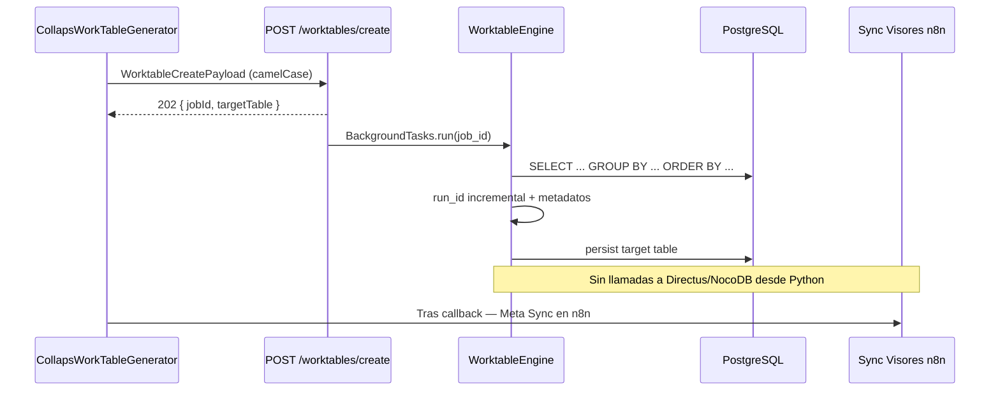

# WorkTables — tablas de trabajo

Endpoint y motor para materializar **tablas derivadas** (agrupadas) a partir de una tabla origen A o B del flujo COLLAPS.

## Endpoint

| Propiedad | Valor |
|---|---|
| Método / ruta | `POST /api/v1/worktables/create` |
| Handler | `create_worktable` (`app/api/worktable_endpoints.py`) |
| Body | `WorktableCreatePayload` (camelCase) |
| Motor | `WorktableEngine` (background) |
| Éxito | `202 Accepted` |

### Respuesta `202`

```json
{
  "status": "accepted",
  "jobId": "<uuid4>",
  "targetTable": "w_table_monthlyFruitSummary",
  "message": "Worktable job queued successfully"
}
```

---

## Payload (wire camelCase)

Modelo: `app/models/worktable_payload.py` (`alias_generator=to_camel`).

| Campo JSON | Python | Tipo | Descripción |
|---|---|---|---|
| `schemaName` | `schema_name` | string | Schema PG (default proyecto) |
| `sourceTable` | `source_table` | string | Tabla origen física |
| `targetTable` | `target_table` | string | Destino físico (convención `w_table_*`) |
| `groupByColumns` | `group_by_columns` | string (CSV) | Columnas de agrupación |
| `orderByRules` | `order_by_rules` | string (CSV) | Reglas `columna ASC\|DESC` |
| `callbackUrl` | `callback_url` | string \| null | Callback opcional |

### Ejemplo válido (contrato API / tests)

```json
{
  "schemaName": "s00001_incancer",
  "sourceTable": "modelo",
  "targetTable": "w_table_resumenPorCategoria",
  "groupByColumns": "categoria, region",
  "orderByRules": "categoria ASC, total DESC",
  "callbackUrl": "https://n8n.example.com/webhook-waiting/..."
}
```

> **Importante:** el API Python valida `groupByColumns` y `orderByRules` como **strings CSV**, no como arrays JSON. Cada regla de orden debe coincidir con `column ASC` o `column DESC`.

---

## Nomenclatura `w_table_*`

En n8n, `CollapsWorkTableGenerator` genera el nombre con `buildWorkTableName(friendlyName)`:

| Nombre amigable | `targetTable` |
|---|---|
| `Resumen Por Categoria` | `w_table_resumenPorCategoria` |
| `Monthly Fruit Summary` | `w_table_monthlyFruitSummary` |

Reglas: ver helper `nodes/helpers/tableNameFormatter.ts` (misma sanitización camelCase que `c_results_*`).

---

## Flujo del motor



Estado actual del motor (`WorktableEngine`):

| Capacidad | Estado |
|---|---|
| Validación Pydantic | ✅ |
| Encolado 202 + BackgroundTasks | ✅ |
| Query GROUP BY / ORDER BY | Esqueleto (SQL seguro pendiente de endurecer) |
| `run_id` incremental + metadatos al final | ✅ patrón compartido con AnalysisEngine |
| Registro CMS (Directus/NocoDB) | ❌ fuera del motor — [Sync de visores](sync-visores.md) |
| Callback al `callbackUrl` | ⏳ TODO en código |
| Agregaciones SUM/COUNT/AVG | ⏳ TODO de negocio |

---

## Nodo n8n

`CollapsWorkTableGenerator`:

1. Lee estructura upstream (`bttfPayload` o `request` del Condenser).  
2. Elige lado **A** o **B** → resuelve `sourceTable`.  
3. Pide nombre amigable → `w_table_<camelCase>`.  
4. Recibe Group By + Order By en la UI.  
5. POST a Cloud Run `/api/v1/worktables/create`.  
6. Adjunta `callbackUrl` desde `$execution.resumeUrl` si existe.

Puede colgarse en paralelo o después del Condenser; no espera a que termine el job de cruce.

## Ver también

- [Integración n8n](integracion-n8n.md)
- [Payload y contratos](payload-y-contratos.md) (cruces / Condenser)
